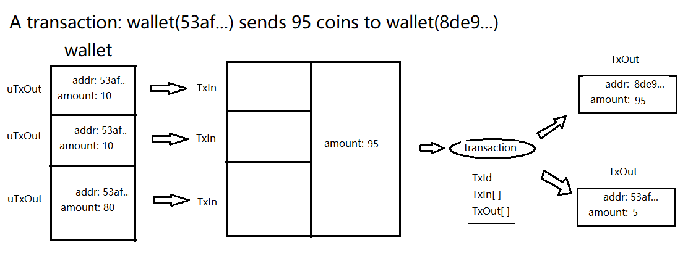

# Transactions

With ***transactions***, we go from a “general purpose”
blockchain to a cryptocurrency.

A transaction contains the following info:

* where the coins come
* where the coins go
* the amount

## workflow

The seller may collect coins from several places
for the deal. And the buyer may cut the overall coins
into several pieces. Each of the "piece" or "place"
is a unit of an asset. It consists of:

* the address (public-key)
* the amount

The address tells who owns this piece of asset.
A TxOut (transaction output) is the structure for this info.
When you own some coins in the blockchain, what you actually
have is a list of unspent transaction outputs (uTxOuts) whose
public key matches to the private key you own.

The bellow picture shows the workflow of a transaction:

## Signature

How to verify that a uTxOut belongs to someone?
How to verify that the transaction indeed triggered
by the owner of the specific uTxOut?

The ***address*** of a uTxOut is in fact a public-key.
It corresponds to a private-key owned by the owner of this uTxOut.

The owner just signs the transaction with his private-key
and generates a signature. Anyone else can verify this signature
with the public-key. Successful verification means that
the transaction is valid.
