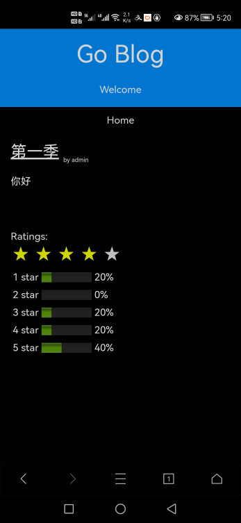

# Intro

A software engineer with years of experiences on network devices.

The blog is intended to keep track of the learning progress
and review some knowledge learnt in the past.

## [#Network Protocols](./protocols.md)

## [#Aritificial Intelligence](./ai.md)

## [#Blockchain](./blockchain/blockchain.md)

## [#Programming](./programming/programming.md)

## [#Reading Notes](./notes/note.md)

## Cases

<table>
<tr><td> </td>
<td>A blog system used for sharing ideas and analyzing these articles via AI algorithms.
Techniques:
  <ul>
<li>datastore: mysql &amp; redis</li>
<li>blog frontend: html/css/javascript/w3.css framework</li>
<li>blog backend: http server via golang</li>
<li>restful api: for any http client that contains access tokens, e.g., curl/testscript/...</li>
<li>data center: AI analysis server via python, NLP algrithms via pytorch</li>
<li>container: they can run in respective docker containers</li>
</ul> </td> </tr>
</table>
