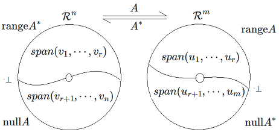
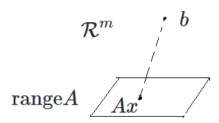

# Minimization

***End goal*** :  
Suppose $$A \in \mathcal{L}(\mathcal{R}^n, \mathcal{R}^m)$$
and $$b \in \mathcal{L}(\mathcal{R}^m)$$.
Find $$x \in \mathcal{L}(\mathcal{R}^n)$$ to get $$min \|b - Ax\|$$.

## Explore eigenvectors of $$A^TA$$ and $$AA^T$$

$$\left(A^TA\right)^T = A^TA$$ shows that $$A^TA$$ is self-adjoint.
Thus $$\mathcal{R}^n$$ has an orthonormal basis
consisting of eigenvectors of $$A^TA$$:

$$A^TA(v_1,\cdots,v_r,v_{r+1},\cdots,v_n)
= (\lambda_1 v_1,\cdots,\lambda_r v_r,0v_{r+1},\cdots,0v_n)$$

And each eigenvalue is no less than 0: $$\lambda_i \geq 0$$.

Now explore the vector $$Av_i$$.

$$(Av_i)^T(Av_j)=v^T_i A^T A v_j = \lambda_j v^T_i v_j$$

If k > r, $$\|Av_k\|^2 = 0 \rightarrow Av_k=0$$.  
If i <= r, suppose
$$u_i = \frac{Av_i}{\|Av_i\|}=\frac{Av_i}{\sqrt{\lambda_i}}=\frac{Av_i}{\sigma_i}$$ .

We get an orthonormal list $$(u_1, \cdots, u_r)$$.
It is an orthonormal basis of rangeA:

$$\begin{align*}
v   & = a_1 v_1 + \cdots + a_r v_r + a_{r+1} v_{r+1} + \cdots + a_n v_n \\
Av  & = a_1Av_1 + \cdots + a_rAv_r + 0 + \cdots + 0 \\
    & = a_1 \sigma_1 u_1 + \cdots + a_r \sigma_r u_r
\end{align*}$$

We also get an orthonormal basis of nullA: $$(v_{r+1},\cdots, v_n)$$.

And because $$null A^\ast = (range A)^\bot$$ and
$$null A = (range A^\ast)^\bot$$, we have that:

The following equation shows that the column space
of M(A) is $$\mbox{range} A$$:

$$Ax = \begin{bmatrix} C_1 & C_2 & \cdots & C_n \end{bmatrix} x$$

The following equation shows that the row space
of M(A) is $$\mbox{null} A$$.

$$Ax = \begin{bmatrix} A_1 \\ A_2 \\ \vdots \\ A_m \end{bmatrix} x$$

Explore the relationship of eigenvectors of $$A^TA$$
and eigenvectors of $$AA^T$$. For i = 1,2,..., r:

$$\begin{align*} A^TAv_i=\lambda_iv_i
& \Rightarrow AA^TAv_i=\lambda_iAv_i \\
& \Rightarrow AA^T\sigma_iu_i=\lambda_i\sigma_iu_i \\
& \Rightarrow AA^Tu_i=\lambda_iu_i \\
\end{align*}$$

Thus $$(u_1,\cdots,u_r)$$ is orthogonal eigenvectors
of $$AA^T$$. Extend it to orthonormal basis of $$\mathcal{R}^m$$:
$$(u_1,\cdots,u_r,u_{r+1},\cdots,u_m)$$ which are orthonormal eigenvectors
of $$AA^T$$.

## Orthogonal Projection for Minimization Problem

We can solve the minimization problem via
the orthogonal projection.

If $$Ax=P_Ub \,(U = \mbox{range} A)$$, we get the min:

$$min\|b-Ax\|=\|P_{U^\bot}b\|$$.

Suppose $$(v_1,\cdots,v_n)$$ is orthonormal basis
of $$A^TA$$, we have

$$\begin{align*}
x    & = a_1v_1 + \cdots + a_nv_n \\
Ax   & = a_1Av_1 + \cdots + a_rAv_r \\
     & = a_1\sigma_1u_1 + \cdots + a_r\sigma_ru_r \\
P_Ub & = \langle b, u_1 \rangle u_1 + \cdots +\langle b, u_r \rangle u_r
\end{align*}$$

Thus,

$$\begin{align*} Ax = P_Ub
& \Rightarrow a_i\sigma_i = u_i^T \\
& \Rightarrow a_i = \frac{u_i^Tb}{\sigma_i}
\end{align*}$$

Thus we have

$$\begin{align*}
x & = \sum_{i=1}^r \frac{u_i^Tb}{\sigma_i}v_i  \\
min\|b-Ax\|^2 &= \|P_{U^\bot} b\|^2 = \sum_{i=r+1}^m(u_i^Tb)^2
\end{align*}$$

## Singular Value Decomposition (SVD)

We can also solve the issue via SVD.

Suppose $$(v_1,\cdots,v_n)$$ is an orthonormal
basis of $$A^TA \in \mathcal{L}(\mathcal{R}^n)$$.
Construct matrix of $$S \in \mathcal{L}(\mathcal{R}^n)$$
with standard basis:

$$M(S,(e_1,\cdots,e_n)) =
\begin{bmatrix} v_1 & \cdots & v_n \end{bmatrix}$$

And

$$M(S^\ast,(e_1,\cdots,e_n)) =
\begin{bmatrix}
v_1^T \\ \vdots \\ v_n^T
\end{bmatrix}$$

Thus

$$\begin{align*}
x        & = a_1v_1 + \cdots + a_nv_n \\
S^\ast x & = a_1S^\ast v_1 + \cdots + a_nS^\ast v_n \\
         & = a_1e_1 + \cdots + a_ne_n \\
\end{align*}$$

Thus $$\|S^\ast x\|  = \|x\|$$, in other words,
$$S^\ast$$ is an isometry. Thus we have

$$\begin{align*}
S^\ast S & = SS^\ast = I \\
S^\ast   & = S^{-1}
\end{align*}$$

Now turn to SVD.

Suppose $$(v_1,\cdots,v_n)$$ is an orthonormal
basis of $$A^TA \in \mathcal{L}({\mathcal{R}^n})$$.
And $$(u_1,\cdots,u_m)$$ is an orthonormal
basis of $$AA^T \in \mathcal{L}({\mathcal{R}^m})$$.
Thus we get the Singular Value Decomposition:

$$A \begin{bmatrix} v_1 & \cdots & v_n \end{bmatrix}
= \begin{bmatrix} u_1 & \cdots & u_m \end{bmatrix}
\begin{bmatrix}
\sigma_1 \\
 & \ddots \\
 & & \sigma_r \\
 & & & 0  \\
 & & & & \ddots  \\
 & & & & & 0  \\
\end{bmatrix}_{mn}
$$

We can write it in matrix form:
$$AV=U\Sigma$$ or $$A=U\Sigma V^T$$

How to get min of $$\|b - A_{mn}x\|$$ ?

$$\begin{align*} \|b-Ax\|
& = \|U^T(b-Ax)\| \\
& = \|U^Tb-U^TAx\| \\
& = \|U^Tb-\Sigma V^Tx\| \\
& = \|U^Tb-\Sigma z\| \\
\|b-Ax\|^2 & = \sum_{i=1}^r(u_i^Tb-\sigma_iz_i)^2 + \sum_{i=r+1}^m(u_i^Tb)^2
\end{align*}$$

To get $$min \|b-Ax\|$$, we need the first term equal 0,
in other words, $$z_i=\frac{u_i^Tb}{\sigma_i}$$.
From $$V^Tx=z$$, we get

$$x = Vz =
\begin{bmatrix}v_1 & \cdots & v_n \end{bmatrix}
\begin{bmatrix}
\frac{1}{\sigma_1}u_1^Tb \\ \vdots \\ \frac{1}{\sigma_r} u_r^Tb\\
0 \\ \vdots \\ 0
\end{bmatrix}
= \sum_{i=1}^r \frac{1}{\sigma_i}u_i^Tbv_i$$

Thus we have

$$min\|b-Ax\|^2 = \sum_{i=r+1}^m(u_i^Tb)^2$$
