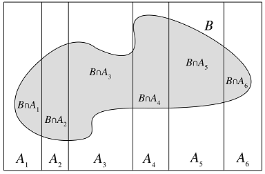

# Decomposition

Decomposition is a way of investigating properties of an object.
The object is cut into pieces with special relationship between them.
We can look deeply into the key point.

## Example: linear combination

A vector can be taken as a linear combination of a basis of
its vector space. Thus we can make use of theorem on a basis.

$$ v = a_1 v_1 + \cdots + a_n v_n$$

We can get the value of a linear map on this vector:

$$T(v) = a_1 T(v_1) + \cdots + a_n T(v_n)$$

## Example: Law of total probability (LOTP)

***Theorem 2.3.6*** (Law of total probability).
Let $$A_1,\cdots,A_n$$ be a partition of the
sample space S (i.e., the $$A_i$$ are disjoint events
and their union is S), with $$P(A_i)>0$$ for all i. Then

$$P(B)=\sum_i P(B\cap A_i)=\sum^n_{i=1} P(B|A_i)P(A_i)$$

The following picture shows the LOTP:

LOTP is used to decompose complicated probability problems
into simpler pieces, and it is often used in tandem with Bayes’ rule.

***Example 2.3.7*** (Random coin). You have one fair coin, and one biased coin which
lands Heads with probability 3/4. You pick one of the coins at random and flip
it three times. It lands Heads all three times. Given this information, what is the
probability that the coin you picked is the fair one?

***solution***

Let A be the event that the chosen coin lands Heads three times and let F be the
event that we picked the fair coin. We are interested in P(F|A), but it is easier to
find P(A|F) since it helps to know which coin we have; this suggests
using Bayes’ rule and the law of total probability. Doing so, we have

$$\begin{align*} P(F|A)
& = \frac{P(A|F)P(F)}{\color{red}{P(A)}} \\
& = \frac{P(A|F)P(F)}{\color{red}{P(A|F)P(F)+P(A|F^C)P(F^C)}} \\
& = \frac{(1/2)^3*1/2}{(1/2)^3*1/2+(3/4)^3*1/2} \\
& \approx 0.23
\end{align*}$$

It is difficult to get P(A) directly. But LOTP helps to solve the issue.

## Example: linearity of Expectation

***Theorem 4.2.1*** (Linearity of expectation).
For any r.v.s X,Y and any constant c,
$$\begin{align*}
E(X+Y) & = E(X)+E(Y) \\
E(cX)  & = cE(X)
\end{align*}$$

We'll prove the first equation.

***hint***

***Definition 4.1.1*** (Expectation of a discrete r.v.).
The expected value (also called the expectation or mean)
of a discrete r.v. X whose distinct possible values are
$$x_1,x_2,\cdots$$ is defined by

$$E(X)=\sum_j x_j P(X=x_j)$$

The event $$X=x_j$$ may be different with the event $$Y=y_k$$.
In other words, the corresponding outcomes maybe different.
It is difficult to combine $$\sum_x xP(X=x)$$ and $$\sum_y yP(Y=y)$$.

However, we can decompose the event $$X=x_j$$ into
small pieces: the event contains all the outcomes
corresponding to the value $$X(s)=x_j$$.
Thus we have another equally valid way to
calculate an average: we can take a weighted average
of the values of individual pebbles. In other words, if
X(s) is the value that X assigns to pebble s,
we can take the weighted average

$$E(X)=\sum_s X(s) P(\{s\})$$

Each item in the sum formula corresponds to an outcome
s of the sample space. And the Mass of s -- P({s}) is fixed
for every r.v. defined on this sample space.
Thus we can now combine E(X) and E(Y) in this "piece" form:

$$\begin{align*} E(X)+E(Y)
& = \sum_s X(s) P(\{s\}) + \sum_s Y(s) P(\{s\}) \\
& = \sum_s (X+Y)(s) P(\{s\}) \\
& = E(X+Y)
\end{align*}$$

## Orthogonal decomposition

***Cauchy-Schwarz Inequality:*** If $$u,\,v\in V$$,
then

$$\|\langle u, v\rangle\| \leq \|u\|\,\|v\|$$

And that the inequality is an equality if and
only if u, v is a scalar multiple of the other.

***PROOF:*** Let's write u in an othogonal
decomposition:

$$u = av + (u-av)$$

We need to find the parameter a such that
av and u-av is orthogonal.

$$0=\langle u-av, av\rangle = \overline{a}\langle u,v\rangle - a\overline{a}\langle v,v\rangle$$

Suppose $$v \neq 0 \mbox{ and } a \neq 0$$, we have

$$a=\frac{\langle u,v\rangle}{\|v\|^2}$$

Take w=u-av, we have the orthogonal decompositon of u:

$$u = \frac{\langle u,v\rangle}{\|v\|^2}v + w$$

Take the norm of both sides:

$$\begin{align*} \|u\|^2
& = \|\frac{\langle u,v\rangle}{\|v\|^2}v\|^2 + \|w\|^2 \\
& = \frac{\|\langle u,v\rangle\|^2}{\|v\|^2} + \|w\|^2 \\
& \geq \frac{\|\langle u,v\rangle\|^2}{\|v\|^2} \\
\end{align*}$$

Thus

$$\|\langle u, v\rangle\| \leq \|u\|\,\|v\|$$.

And that the inequality is an equality if and
only if w=0, i.e., u, v is a scalar multiple of the other.

## projection decompositon

### Example 1

Suppose $$P\in\mathcal{L}(V) \mbox{ and } P^2=P$$.
Prove that $$V=null\,P \oplus range\,P$$.

***PROOF:*** We can write any $$v\in V$$ with
the following decompositon:

$$v=Pv+(v-Pv)$$

Since $$P^2=P$$, we have that $$P(v-Pv)=0$$,
wich implies $$v-Pv\in null\,P$$. Thus we can write the vector
space V as a sum decompositon: $$V=range\,P + null\,P$$.

For any $$u\in range\,P$$, there exists $$v\in V$$
such that $$u=Pv$$. Thus we have that

$$u=Pv=P^2v=Pu$$

Suppose $$u\in range\,P \cap null\,P$$, we have that
$$u=Pu=0$$. Thus $$range\,P \cap null\,P=\{0\}$$.
Combined with that of $$V=range\,P + null\,P$$,
we have that

$$V=range\,P\oplus null\,P$$

## orthogonal projection decomposition

### Example 2

The mininization problem often arises: given a subspace U of V
and a point v from V , find a point u from U such that $$\|v - u\|$$ is
as small as possible.

Suppose P is any projection of V onto U and $$P_U$$ is
an orthogonal projection of V onto U. We can write
any $$v\in V$$ with the "projection" decompositon form:

$$\begin{align*} v
& = Pv+(v-Pv) \\
& = P_Uv+(v-P_Uv)
\end{align*}$$

where $$Pv, P_Uv \in U$$ and $$v-P_Uv\in U^{\bot}$$.
Thus we have $$v - u = v-Pv = (P_Uv-Pv)+(v-P_Uv)$$.
Since $$P_Uv-Pv \in U$$ and $$v-P_Uv \in U^{\bot}$$,
we have

$$\|v-u\|^2 = \|P_Uv-Pv\|^2 + \|v-P_Uv\|^2 \geq \|v-P_Uv\|^2$$

In other words,

$$\|v-u\| \geq \|v-P_Uv\|$$

where the inequality is equality if and only
if $$P_U=P$$.  

Thus We can solve this by an orthogonal projection:

$$ u = P_{U}v = \langle v , e_1 \rangle e_1 + \cdots +
                \langle v , e_m \rangle e_m $$

As we can see, the decompositon help a lot for our problem.

## Singular-Value Decompositon

### Example 3

Suppose $$S\in\mathcal{L}(V)$$. Prove that S is
an isometry if and only if all the singular values
of S equal 1.

***PROOF:*** We're dealing with the singular values,
let's write the SVD form of Sv:

$$Sv = s_1\langle v, e_1\rangle f_1 + \cdots + s_n\langle v, e_n\rangle f_n$$

We have

$$\begin{align*} s_1=\cdots=s_n=1
& \Rightarrow Sv=\langle v, e_1\rangle f_1 + \cdots + \langle v, e_n\rangle f_n \\
& \Rightarrow \|Sv\|^2=|\langle v, e_1\rangle|^2 + \cdots + |\langle v, e_n\rangle|^2=\|v\|^2\\
& \Rightarrow \|Sv\|=\|v\|, \mbox{ i.e., S is an isometry} \\
\end{align*}$$

Let's prove the other direction.
If S is isometry, for any $$s_k$$,
we have $$1=\|Se_k\|^2=\|s_kf_k\|^2=|s_k|^2$$.
Since singular values are nonnegative, we have $$s_k=1$$.
In other words, all singular values of S equal 1.

### Example 4

Suppose $$T\in\mathcal{L}(V)$$. Let $$\hat s \mbox{ and } s$$ denote
the smallest and biggest singular values of T respectively.
Prove that

$$\hat s\|v\| \leq \|Tv\| \leq s\|v\|$$

for every $$v \in V$$.

***PROOF:*** We're dealing with the singular values,
let's write the SVD form of Tv:

$$Tv = s_1\langle v, e_1\rangle f_1 + \cdots + s_n\langle v, e_n\rangle f_n$$

Thus we have

$$\begin{align*} \|Tv\|^2
& = s_1^2|\langle v, e_1\rangle|^2 + \cdots + s_n^2|\langle v, e_n\rangle|^2 \\
& \leq s_{max}^2(|\langle v, e_1\rangle|^2 + \cdots + |\langle v, e_n\rangle|^2) \\
& = s^2\|v\|^2
\end{align*}$$

Thus we have $$\|Tv\| \leq s\|v\|$$.
We can prove the left inequality in the same way.
