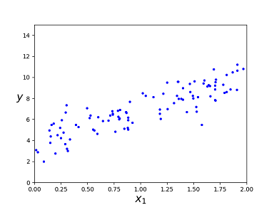
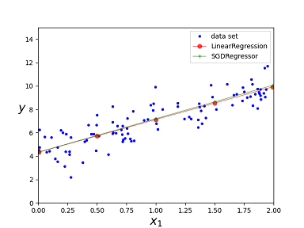

<script id="MathJax-script" async src="https://cdn.jsdelivr.net/npm/mathjax@3/es5/tex-mml-chtml.js"></script>

# Linear model

## What is Linear model?

A linear model make a prediction by simply computing
a weighted sum of the input features, plus a constant
called the bias term (also called the intercept term).

$$ \hat y = \theta_0 + \theta_1 x_1 + \cdots + \theta_n x_n$$

## Dataset

```python
# generate linear-looking data plus some noise:
import numpy as np
X = 2 * np.random.rand(100,1)
y = 4 + 3 * X + np.random.randn(100,1)
```

Plot the dataset in the following picture.



## LinearRegression class

Perform Linear Regression using scikit-learn's
[LinearRegression][LinearRegression] class.

```python
from sklearn.linear_model import LinearRegression

lin_reg = LinearRegression()
lin_reg.fit(X, y)
lin_reg.intercept_, lin_reg.coef_
Out[3]: (array([4.32075143]), array([[2.80811042]]))

# the test set
X_new = np.array([[0],[2]])
y_lin_predict = lin_reg.predict(X_new)
y_lin_predict
Out[4]:
array([[4.32075143],
       [9.93697226]])
```

## SGDRegressor class

Perform Linear Regression using scikit-learn's
[SGDRegressor][SGDRegressor] class.

```python
from sklearn.linear_model import SGDRegressor

sgd_reg = SGDRegressor(max_iter=1000, tol=1e-3, penalty=None, eta0=0.1, random_state=42)
sgd_reg.fit(X, y.ravel())
Out[9]: SGDRegressor(eta0=0.1, penalty=None, random_state=42)

sgd_reg.intercept_, sgd_reg.coef_
Out[14]: (array([4.3270307]), array([2.87206748]))

y_sgd_predict = sgd_reg.predict(X_new)
y_sgd_predict
Out[16]: array([ 4.3270307 , 10.07116566])
```

## Plot the predictions from different algorithms

```python
import matplotlib.pyplot as plt

# plot data set
plt.plot(X, y, "b.", label="data set")
plt.xlabel("$x_1$", fontsize=18)
plt.ylabel("$y$", rotation=0, fontsize=18)
plt.axis([0, 2, 0, 15]) 

X_test = np.array([[0.01], [0.5], [1], [1.5], [1.99]])
y_lin_predict = lin_reg.predict(X_test)
plt.plot(X_test, y_lin_predict, 'or-', lw=0.8, alpha=0.7, label='LinearRegression')

y_sgd_predict = sgd_reg.predict(X_test)
plt.plot(X_test, y_sgd_predict, "+g-", lw=0.8, alpha=0.7, label="SGDRegressor")
plt.legend()
```

Here is the plotting image:



## Algorithms

The learning algorithms are discussed in [Training a model][Principle of training].
The [scikit-learn doc][scikit-learn linear algorithms]
gives more algorithms for the linear model.

If we look deeply at the previous algorithms and
we'll find that they may not work well on some cases.

The coefficient estimates for Ordinary Least Squares
rely on the independence of the features. When features
are correlated and the columns of the design matrix **X**
have an approximate linear dependence, the
design matrix becomes close to singular and
as a result, the least-squares estimate becomes
highly sensitive to random errors in the observed target,
producing a large variance. This situation of
multicollinearity can arise, for example,
when data are collected without an experimental design.

### SVD solution's perspective

The SVD solution gives the model params:

$$\theta = \sum_{i=1}^r \frac{1}{\sigma_i}u_i^Tyv_i$$

If the sigular value $$\sigma_i$$ is very small,
then the model params will be very large. Any noise
in the ovserved target will lead to
very large variance of the model params.

### condition number's perspective

One should think of the ***condition number***
as being (very roughly) the rate at which the solution
will change with respect to a change in the observed target.

The wikipedia [condition number][condition number]
gives more detail of it. For a linear equation Ax = b.
Let e be the error in b. Assuming that A is a
nonsingular matrix, the error in the solution
$$A^{−1}b$$ is $$A^{−1}e$$. The ratio of the relative error
in the solution to the relative error in b is

$${\frac {\|A^{-1}e\|}{\|A^{-1}b\|}}/{\frac {\|e\|}{\|b\|}}
= {\frac {\|A^{-1}e\|}{\|e\|}}{\frac {\|b\|}{\|A^{-1}b\|}}
\leq \|A^{-1}\|\,\|A\|
= \kappa (A)$$

If $$\|\cdot \|$$ is the norm defined in the
square-summable sequence space, then

$$\kappa (A)={\frac {\sigma_{\text{max}}(A)}{\sigma_{\text{min}}(A)}}$$

where $$\sigma_{\text{max}}(A)$$ and $$\sigma_{\text{min}}(A)$$
are maximal and minimal singular values of A respectively.

As we can see, small minimal singular value leads to
big condition number, which means a
big variance of the model params.

How to resolve this issue? We can take the
Ridge Regression into consideration.

[conditon number]: https://en.wikipedia.org/wiki/Condition_number#Matrices
[scikit-learn linear algorithms]: https://scikit-learn.org/stable/modules/linear_model.html#ordinary-least-squares
[Principle of training]: ./principle_of_training.md
[LinearRegression]: https://scikit-learn.org/stable/modules/generated/sklearn.linear_model.LinearRegression.html
[SGDRegressor]: https://scikit-learn.org/stable/modules/generated/sklearn.linear_model.SGDRegressor.html