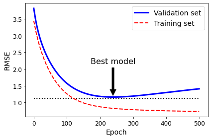
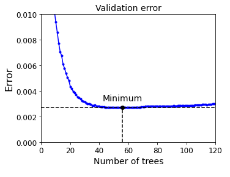

# Challenges of ML

Machine Learning is a techonique to learn rules
from examples (the data) automatcially. Thus there
are mainly two important things to deal with:

* data (the examples)
* algorithms (how to learn rules)

***Most works of ML project are to resolve the challenges*** :
bad data, bad algorithms, performance, and so on.

## bad data

* Nonrepresentative training data. (sampling noise & sampling bias)
* Poor-quality data (outliers, errors, noise) solution: data cleaning
* Irrelevant features. solution: feature engineering
  
## bad algorithms

Bad algorithm means that the model has the
overfitting and/or underfitting issue.

## Underfitting and Overfitting

Suppose we have a data set generated
using a quadratic model with gaussian noise.
The following picture shows these issues.
The optimal model best fits the training data.

### Underfitting the training data

It occurs when the model is too simple to learn
the underlying structure of the data. Thus the model
performs badly on the training data.
[Performance measure](./performance_measures.md) tells
how to evalute the performance of a model.

Solutions:

* select a more powerful model
* feed better features (feature engineering)
* reduce the constrains on the model

The [Improvement](./improvement.md) page shows how to
improve the performance of the model.

### Overfitting the training data

Overfitting means that the model performs well on
the training data, but it does not generalize well
to new cases.

It happens when a complex algorithm detects subtle patterns
that are not real or only belong to the training data. For example:

* training set is noisy: errors, outliers and noise (e.g., Gaussian noise)
* sampling noise because of small sampling (i.e., nonrepresentative data)
* pure chance: e.g., "category names" of "category" feature have some pattern

Solutions:

* simplify the model: fewer params, fewer attris, constraining the model
* gather more training data
* reduce noise in the training data
* by some strategy, e.g., early stopping

The strategy method will be discussed here and others
will be discussed in other pages.

## Learning Curves

How can you tell whether your model is overfitting the data
or underfitting the data?

If a model performs well on the training data
but generalizes poorly according to the cross-validation
metrics, then the model is overfitting.
If a model performs poorly on both, then it is underfitting.
This is one way to tell when a model is too simple
or too complex.

Another way to tell is to look at the ***learning curves*** :
these are plots of the model's performance on the
training set and validation set as a function of
the training set size. The following picture shows
the learning curves of the linear model and 10-th degree polynomial model.

The above picture shows that it has a high ***bias***,
which means that the model underfits the training data.
The below picture shows that the bias is low but there
is a gap between the curves -- high ***variance***, which means
that the model overfits the training data.

## Reduce Variance (overfitting issue) by Strategy

We can find ways to "reduce" the subtle patterns
that only belong to the training data,
or preclude the model from learning these patterns.

***Ensemble Learning*** helps for this task.
A Random Forest is an ensemble of Decision Trees,
generally trained via the bagging method (or sometimes
pasting). ***Bagging introduces extra diversity***
in the subsets that each predictor is trained on,
and extra diversity means that the unexpected subtle
patterns are somewhat "reduced", so the ensemble's
variance is reduced.

We can also stop the training process before the model
learns these patterns. The method is called ***early stopping***.
It works for the algorithms that learn rules ***gradually***.

The iterative algorithms ***Gradient Descent*** gradually
tweaks the model parameters to minimize the cost function
over the training set. It iteratives the training set
many rounds (each round is called an epoch) to detect
patterns existing in the trainin set. Many more rounds
of iteration means many more patterns will be learnt.
However, it also means that the subtle patterns that
only belong to training set will also be learnt. Thus
the learning process shall be stopped earlier.

Another example is the ***Boosting*** algorithm. It refers to
any Ensemble method that can combine several
weak learners into a stronger learner. The general
idea of most boosting methods is to train predictors
sequentially, each trying to correct its predecessor.
More predictors means more patterns are learnt, but
it also increases the risk of overfitting. Thus we
shall control the number of predictors.

