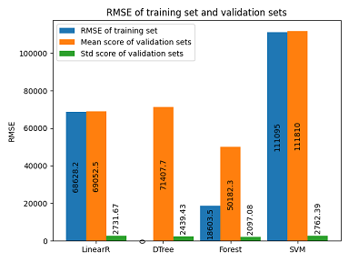

# Cross Validation

Cross-Validation plays an important role in the model
selection and model fine-tuning. It helps a lot to check
overfitting & underfitting issue and fine-tune the model.

We will go through the whole process to show how cross-validation works.

## Underfitting and Overfiting issue

Suppose we have prepared the data for training and
we will try the linear model at first. The "prepare data"
code was showed in the [Pipeline](./data_prepare_pipeline.md) page.

```python
from sklearn.linear_model import LinearRegression

lin_reg = LinearRegression()
lin_reg.fit(housing_prepared, housing_labels)
```

Check the regression model's RMSE on the whole
training set:

```python
from sklearn.metrics import mean_squared_error

housing_predictions = lin_reg.predict(housing_prepared)
lin_mse = mean_squared_error(housing_labels, housing_predictions)
lin_rmse = np.sqrt(lin_mse)
lin_rmse
Out[7]: 68628.19819848922
```

It's not a good score: most median_housing_values range
between \$120,000 and \$256,000.
The model ***underfits the training data***. It happens
when the features do not provide enough information to
make a good prediction, or when the model is not powerful enough.

Let's try a more powerful model to resolve the underfitting issue.
Suppose we try the decision tree model:

```python
from sklearn.tree import DecisionTreeRegressor

tree_reg = DecisionTreeRegressor(random_state=42)
tree_reg.fit(housing_prepared, housing_labels)

housing_predictions = tree_reg.predict(housing_prepared)
tree_mse = mean_squared_error(housing_labels, housing_predictions)
tree_rmse = np.sqrt(tree_mse)
tree_rmse
Out[12]: 0.0
```

The underfitting issue is resolved. And it seems
this model is absolutely perfect. However, it is
much more likely that the model has
***badly overfitted the training data***. To check
whether there is an overfitting issue, we can make
use of cross-validation introduced in [Split Data Set](./split_data_set.md)
page: split the training set into two part, train
the model with one part (smaller training set) and
evaluate the performance with the other part (validation set).

## Cross Validation for Model Selection

Scikit-Learn provides a K-fold cross-validation feature.
The following code randomly splits the training set
into 10 distinct subsets called folds, then each time
it picks a different fold for evaluation and trains
the model with the other 9 folds. Thus it trains and
evaluates the model 10 times. The result is an array
containing 10 evaluation scores.

```python
from sklearn.model_selection import cross_val_score

scores = cross_val_score(tree_reg, housing_prepared, housing_labels,
                         scoring="neg_mean_squared_error", cv=10)
tree_rmse_scores = np.sqrt(-scores)

def display_scores(scores):
    print("Scores:", scores)
    print("Mean:", scores.mean())
    print("Standard deviation:", scores.std())

display_scores(tree_rmse_scores)

Scores: [70194.33680785 66855.16363941 72432.58244769 70758.73896782
 71115.88230639 75585.14172901 70262.86139133 70273.6325285
 75366.87952553 71231.65726027]
Mean: 71407.68766037929
Standard deviation: 2439.4345041191004
```

The scores shows that Decision Tree Model indeed
***overfitted*** the training data, it performs badly
on the validation set. Is Decision Tree Model better
than the Liear Model? Just run the cross-validation
on the Linear Model for a check:

```python
lin_scores = cross_val_score(lin_reg, housing_prepared, housing_labels,
                             scoring="neg_mean_squared_error", cv=10)
lin_rmse_scores = np.sqrt(-lin_scores)
display_scores(lin_rmse_scores)

Scores: [66782.73843989 66960.118071   70347.95244419 74739.57052552
 68031.13388938 71193.84183426 64969.63056405 68281.61137997
 71552.91566558 67665.10082067]
Mean: 69052.46136345083
Standard deviation: 2731.6740017983498
```

It shows that the Decision Tree Model is overfitting
so badly that it performs worse than Linear Regression Model.
The underfitting or overfitting issue is not resolved, we
need to try more models.

Try the Random Forests:

```python
from sklearn.ensemble import RandomForestRegressor

forest_reg = RandomForestRegressor(n_estimators=100, random_state=42)
forest_reg.fit(housing_prepared, housing_labels)

# check underfitting issue
housing_predictions = forest_reg.predict(housing_prepared)
forest_mse = mean_squared_error(housing_labels, housing_predictions)
forest_rmse = np.sqrt(forest_mse)
forest_rmse
Out[16]: 18603.515021376355

# check overfitting issue
forest_scores = cross_val_score(forest_reg, housing_prepared, housing_labels,
                                scoring="neg_mean_squared_error", cv=10)
forest_rmse_scores = np.sqrt(-forest_scores)
display_scores(forest_rmse_scores)

Scores: [49519.80364233 47461.9115823  50029.02762854 52325.28068953
 49308.39426421 53446.37892622 48634.8036574  47585.73832311
 53490.10699751 50021.5852922 ]
Mean: 50182.303100336096
Standard deviation: 2097.0810550985693
```

It looks much better. But the score on the training data
is still much lower than on the validation sets, meaning
that the model is still overfitting the training set.

Try the Support Vector Machine. And the result shows
Support Vector Machine performs worse.

```python
from sklearn.svm import SVR

svm_reg = SVR(kernel="linear")
svm_reg.fit(housing_prepared, housing_labels)
housing_predictions = svm_reg.predict(housing_prepared)
svm_mse = mean_squared_error(housing_labels, housing_predictions)
svm_rmse = np.sqrt(svm_mse)
svm_rmse
Out[17]: 111094.6308539982

# check overfitting issue
svm_scores = cross_val_score(svm_reg, housing_prepared, housing_labels,
                                scoring="neg_mean_squared_error", cv=10)
svm_rmse_scores = np.sqrt(-svm_scores)
display_scores(svm_rmse_scores)

Scores: [105342.09141998 112489.24624123 110092.35042753 113403.22892482
 110638.90119657 115675.8320024  110703.56887243 114476.89008206
 113756.17971227 111520.1120808 ]
Mean: 111809.84009600841
Standard deviation: 2762.393664321567
```

Compare four models:



We have tried several models and shortlist a few promising models.
