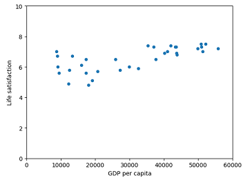

# Data Collection and Visualization

There're many tools for data collection and visualization.
We shall be familiar with one of these tools.

As stated in its website, [pandas](https://pandas.pydata.org/) is
a fast, powerful, flexible and easy to use open source
data analysis and manipulation tool,
built on top of the Python programming language.

Suppose we want to find the relationship between
happeness and wealth, we download the Better Life Index
data from OECD's website and GDP per capita data from
the IMF's website. Then we get two csv files: oecd_bli_2015.csv
and gdp_per_capita.csv. With these data, we can train
a model for the investigation.

We can merge data from these two files and then visualize
it by pandas to get insights.

```Python
import os
import pandas as pd

datapath = os.path.join("datasets", "lifesat", "")

oecd_bli = pd.read_csv(datapath + "oecd_bli_2015.csv", thousands=',')
oecd_bli = oecd_bli[oecd_bli["INEQUALITY"]=="TOT"]
oecd_bli = oecd_bli.pivot(index="Country", columns="Indicator", values="Value")

gdp_per_capita = pd.read_csv(datapath+"gdp_per_capita.csv", thousands=',', delimiter='\t',
                             encoding='latin1', na_values="n/a")
gdp_per_capita.rename(columns={"2015": "GDP per capita"}, inplace=True)
gdp_per_capita.set_index("Country", inplace=True)

full_country_stats = pd.merge(left=oecd_bli, right=gdp_per_capita, left_index=True, right_index=True)
full_country_stats.sort_values(by="GDP per capita", inplace=True)
```

And we can get a table like following:

```Python
gdp_and_bli = full_country_stats[["GDP per capita","Life satisfaction"]]
gdp_and_bli.loc[["Hungary","Korea","France","Australia","United States"]].head()

Out[1]:
               GDP per capita  Life satisfaction
Country
Hungary             12239.894                4.9
Korea               27195.197                5.8
France              37675.006                6.5
Australia           50961.865                7.3
United States       55805.204                7.2

```

We can visualize the data by pandas and matplotlib:

```Python
import matplotlib.pyplot as plt

gdp_and_bli.plot(kind='scatter', x="GDP per capita", y='Life satisfaction')
plt.axis([0, 60000, 0, 10])
```

From the plot picture, we can assume there's
a "linear" relationship. And can train it with a linear model.


