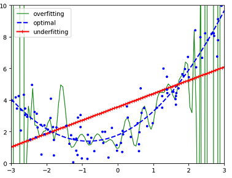
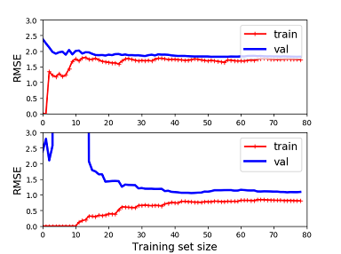

# Generalization Errors

The end goal of ML is to make the trained model
perform well on new cases (in production).
Thus we need to find ways to reduce the generalization
error: ***Bias, Variance and Irreducible*** error.

High bias corresponds to the ***underfitting*** issue and
high variance corresponds to the ***overfitting*** issue.

## Underfitting and Overfitting

Suppose we have a data set generated
using a quadratic model with gaussian noise.
The following picture shows these issues.
The optimal model best fits the training data.

### Underfitting the training data

It occurs when the model is too simple to learn
the underlying structure of the data. Thus the model
performs badly on the training data.
[Performance measure](./performance_measures.md) tells
how to evalute the performance of a model.

Solutions:

* select a more powerful model
* feed better features (feature engineering)
* reduce the constrains on the model

The [Improvement](./improvement.md) page shows how to
improve the performance of the model.

### Overfitting the training data

Overfitting means that the model performs well on
the training data, but it does not generalize well
to new cases.

It happens when a complex algorithm detects subtle patterns
that are not real. For example:

* training set is noisy: errors, outliers and noise (e.g., Gaussian noise)
* sampling noise because of small sampling (i.e., nonrepresentative data)
* pure chance: e.g., "category names" of "category" feature have some pattern

Solutions:

* simplify the model: fewer params, fewer attris, constraining the model
* gather more training data
* reduce noise in the training data

## Bias and Variance

How can you tell whether your model is overfitting the data
or underfitting the data?

If a model performs well on the training data
but generalizes poorly according to the cross-validation
metrics, then the model is overfitting.
If a model performs poorly on both, then it is underfitting.
This is one way to tell when a model is too simple
or too complex.

Another way to tell is to look at the ***learning curves*** :
these are plots of the model's performance on the
training set and validation set as a function of
the training set size. The following picture shows
the learning curves of the linear model and 10-th degree polynomial model.

The above picture shows that it has a high ***bias***,
which means that the model underfits the training data.
The below picture shows that the bias is low but there
is a gap between the curves -- high ***variance***, which means
that the model overfits the training data.

## Irreducible Error

Irreducible error is due to the noisiness of
the data itself. The only way to reduce this
type of error is to clean up the data (e.g.,
fix the data source, such as broken sensors,
or detect and remove outliers).
