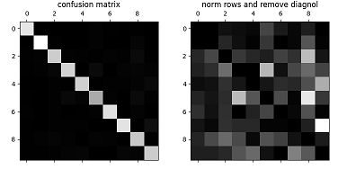

# Improvement

After [Cross-Validation](./cross_validation.md)
and [Fine-Tuning the models](./fine_tune_the_model.md),
we get a promising model. Now it's time
to find ways to improve its [performance](./performance_measures.md)
as best as we can. For example,

* data:
  * do more with challenges of bad data
  * more feature engineering
  * tune hyperparameters of data-preparation steps
* algorithm:
  * compare many more models and tune hyperparameters
  * optimize underlying algorithms
* final output: analyze errors
* performance measures: analyze metrics
* introduce more techniques

Note that the list contains steps that we have
already gone through. In fact it's an iterative
process: once we get the pipeline up and running,
we can anaylze outputs of some steps to gain
more insight, and then come back to the whole
exploration steps to make some improvement.
Repeat the process until we get an accepted performance.

Also note that the final goal is to reduce
the [generalization error](./ml_tech.md): Bias, Variance
and Inrreducible error. We shall reduce all these errors.

## Data Preparation Steps

We can go back to the data preparation stage and optimize
some steps.

From the [Fine-tune the model](./fine_tune_the_model.md) page,
we have introduced a method to re-preprocess the data --
sort the feature according to its importance, take
the feature number as a hyperparameter, and then fine-tune
this hyperparameter with cross-validation.

After the repreparation, retrain the model with the optimized features.

## Error Analysis

Analyzing the output errors may give some ideas to
improve the performance.

Suppose we explore the confusion matrix of the sgd model.
(introduced in [performance measures](./performance_measures.md) page).
Each row represents an actual class and each column represents
a predicted class.

```python
y_train_pred = cross_val_predict(sgd_clf, X_train, y_train, cv=3)
conf_mx = confusion_matrix(y_train, y_train_pred)
```

Plot the confusion matrix:



Focus on the right picture. We can clearly see the kinds
of errors the classifier makes. As we can see, many images
are misclassified as 8s, while the actual 8s in general
get properly classified as 8s. There're other errors.
For example, 3s and 5s often get confused with each other.

Our goal is to find ways to reduce these errors.
Suppose we want to reduce the false 8s. We can check
the following solutions:

* gether more training data that looks like 8s (but are not)
  so that the classifier can learn to distinguish them
  from real 8s.
* engineer new features to help the classifier -- for example,
  writing an algorithm to count the number of closed loops
* preprocess the images to make some patterns, such as closed
  loops, stand out more.
