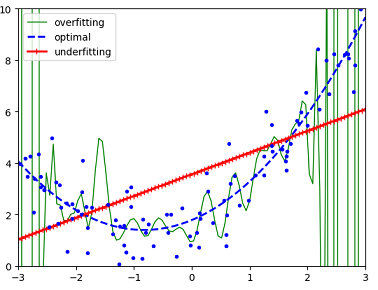
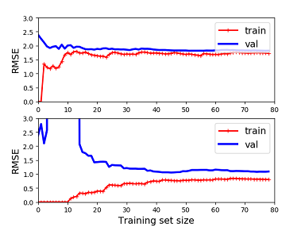

# Machine Learning tech

The previous tutorials [Machine learning](../ml_tutorials/ml_tutorials.md)
and [Neural Networks](../neural_networks/neural_networks.md) give
an intuition about what ML looks like and how it works under the hood.
Now we will turn to topics about what a professional engineer deals with
in his actual works.

## Topics in this tutorial

[Challenges of Machine Learning](./ml_tech.md),
[Data Collection and Visualization](./data_collection_and_visualization.md),  
[Data Prepare](./data_prepare.md): investigation, data clean, feature engineering,
feature scaling, [Pipeline](./data_prepare_pipeline.md), [Split data set](./split_data_set.md)

## Challenges of Machine Learning

Machine Learning is a techonique to learn rules
from examples (the data) automatcially. Thus there
are mainly two important things to deal with:

* data (the examples)
* algorithms (how to learn rules)

There're challenges to handle data and algorithms. Most of the work
of ML project development is to resolve these challenges.

* bad data
* bad algorithms
* trade-off of algorithms, performance, and so on

### bad data

* Insufficient quantity of training data
* Nonrepresentative training data. (sampling noise & sampling bias)
* Poor-quality data (outliers, errors, noise) solution: data cleaning
* Irrelevant features. solution: feature engineering
  
### bad algorithms

* overfitting
* underfitting

Suppose we have a data set generated
using a quadratic model with gaussian noise.
The following picture shows models trained by three
different algorithms.

#### overfitting the training data

Overfitting means that the model performs well on
the training data, but it does not generalize well
to new cases.

It happens when a complex algorithm detects subtle patterns
that are not real. For example:

* training set is noisy: errors, outliers and so on
* sampling noise because of small sampling
* pure chance: e.g., feature names has some pattern

Solutions:

* simplify the model: fewer params, fewer attris, constraining the model
* gather more training data
* reduce noise in the training data

#### underfitting the training data

It occurs when the model is too simple to learn
the underlying structure of the data.

Solutions:

* select a more powerful model
* feed better features (feature engineering)
* reduce the constrains on the model

#### which is the case ?

How can you tell that your model is overfitting
or underfitting the data?

If a model performs well on the training data
but generalizes poorly according to the cross-validation
metrics, then the model is overfitting.
If a model performs poorly on both, then it is underfitting.
This is one way to tell when a model is too simple
or too complex.

Another way to tell is to look at the learning curves:
these are plots of the model's performance on the
training set and validation set as a function of
the training set size. The following picture shows
the learning curves of the linear model and 10-th degree polynomial model.

#### generalization error

A model's generalization error can be expressed
as three very different errors:

* Bias

It is due to wrong assumptions, such as assuming
that the data is linear when it is actually quadratic.
A high-bias model is most likely to underfit the training data.

* Variance
  
It is due to the model's excessive sensitivity
to small variantions in the training data.
A complex model is likely to have high variance
and thus overfit the training data.

* Irreducible error

It is due to the noisiness of the data itself.
