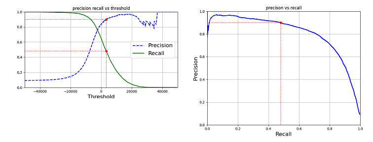
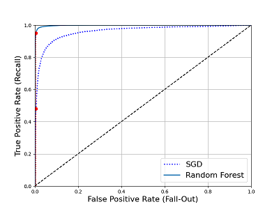

# Performance Measures

We evaluate the regressor with RMSE (Root Mean Square Error)
introduced in the [Cross Validation](./cross_validation.md) page.
But it is a different story to evaluate a classifier.

Suppose we have the MNIST dataset that contains images
representing 0~9 digits. And we create a binary classifier
that can tell whether or not an image is the digit 5. And then
check the performance of the classifier.

We will introduce 3 different performance measures for
this classifier:

* accuracy
* precison and recall
* receiver operating characteristic -- ROC

## Prepare data and the binary classifier

```python
# load dataset and split it
import numpy as np
from sklearn.datasets import fetch_openml
mnist = fetch_openml('mnist_784', version=1, as_frame=False)

X, y = mnist["data"], mnist["target"]
y = y.astype(np.uint8)
X_train, X_test, y_train, y_test = X[:60000], X[60000:], y[:60000], y[60000:]

# it's a binary classifier, thus label shall be binary
y_train_5 = (y_train == 5)
y_test_5 = (y_test == 5)

from sklearn.linear_model import SGDClassifier

sgd_clf = SGDClassifier(max_iter=1000, tol=1e-3, random_state=42)
# sgd_clf.fit(X_train, y_train_5)
```

## Measuring Accuracy Using Cross-Validation

We may spontaneously check the accuracy of a classifier for
the performance measure.
Let's evaluate the SGDClassifier model with cross_val_score function.

```python
from sklearn.model_selection import cross_val_score
cross_val_score(sgd_clf, X_train, y_train_5, cv=3, scoring="accuracy")

Out[181]: array([0.95035, 0.96035, 0.9604 ])
```

Above 93% accuracy on all 3 cross-validation folds!
It seems that the performance is very good!
However, we'll be amazed by the accuracy of the following "not-5" class:

```python
from sklearn.base import BaseEstimator
class Never5Classifier(BaseEstimator):
    def fit(self, X, y=None):
        pass
    def predict(self, X):
        return np.zeros((len(X), 1), dtype=bool)

never_5_clf = Never5Classifier()
cross_val_score(never_5_clf, X_train, y_train_5, cv=3, scoring="accuracy")

Out[184]: array([0.91125, 0.90855, 0.90915])
```

Never5Calssifier just predicts all images to be not 5.
It has over 90% accuracy! Almost the same performance
with that of the SGDClassifier model! What happened?

It is simply because only about 10% of the images are 5s!

It demonstrates that accuracy is generally not
a preferred performance mearsure, especially when
we're dealing with skewed dataset. (i.e., when some
classes are much more frequent than others).

## Confusion Matrix

A much better way to evaluate a classifier is to
make use of the confusion matrix. The general idea
is to count the number of times instance of class A
are classified as class B. This information is preferred
in many cases.

The following code get the confusion matrix of our case.

```python
# Note: cross_val_predict return predictions, different with cross_val_score
from sklearn.model_selection import cross_val_predict
y_train_pred = cross_val_predict(sgd_clf, X_train, y_train_5, cv=3)

from sklearn.metrics import confusion_matrix
confusion_matrix(y_train_5, y_train_pred)

Out[3]:
array([[53892,   687],
       [ 1891,  3530]], dtype=int64)
```

We're using a binary classifier, thus the confusion matrix is 2 by 2.
Let's create a table:

 Confusion Matrix        | Predicted Negative         | Predicted Positive
------------------------ | -------------------------- | ------------------
Actual Negative | True Negative  (TN): 53892 | False Positive (FP): 687
Actual Positive | False Negative (FN): 1891  | True Positive  (TP): 3530

Each row of a confusion matrix represents an ***actual class***,
while each column represents a ***predicted class***.
And each element of the matrix represents
the number of times instance of a specific actual class are
classified as a specific predicted class.

## Precison and Recall

The confusion matrix gives lots of information,
but sometimes we prefer a more concise metric.
An interesting one is the accuracy of the positive predictions:
***precision*** of the classifier: precison = TP / (TP+FP).
It is typically used along with another metric named ***recall***,
also called ***sensitivity*** or the ***true positive rate*** (TPR):
recall = TP / (TP+FN).

There're cases where we care about precision or recall or both. And it can
be the metric of the performance measure.

* ***care about precison***
    Suppose we want to train a classifier to detect
    videos that are safe for kids. We will prefer a classifier
    that rejects many good videos but keeps only safe
    ones (high precision), rather than a classifier with
    high recall but lets a few bad videos show up in the product.
* ***care about recall***
    Suppose we want to train a classifier to detect
    shoplifters in surveillance images. It is probably fine
    if the classifier has only 30% precision as long as
    it has 99% recall.

## Precison/Recall Trade-off

There is a concept of ***precision/recall trade-off*** : increasing
precision reduce recall, and vice versa.

For each instance, the classifier computes a score (or probability, or the-alike).
If the score is greater than a ***threshold***, it assigns
the instance to the positive class; otherwise it assigns it to
the negative class. Thus decreasing the threshold will increase
precison and reduce recall. Increasing the threshlod will change
them accordingly.

The following picture shows the relationship of precison, recall and threshold.



However, if we go back to the Never5Classifier model,
precison/recall still does not show real performance.
The precision always equals to 90% and recall always equals to 100%.

## The ROC Curve

The receiver operating characteristic (ROC) curve is
another common tool used with binary classifiers. It
plots recall (true positive rate) vs FPR (false positive rate).
There's also a trade-off: the higher the recall (TPR),
the more false positive (FPR) the classifier produces.

The following shows ROC curve of two different models:



The Random Forest model performs better (the ROC curve
is much close to the top-left corner).

There's a concise metric to compare classifiers:
the ***area under the curve*** (AUC). A perfect classifier
will have a ROC AUC equal to 1, whereas a purely random
classifier (the dotted line) have a ROC AUC equal to 0.5.

```python
from sklearn.metrics import roc_auc_score
sgd_roc_auc = roc_auc_score(y_train_5, y_scores)
forest_roc_auc = roc_auc_score(y_train_5, y_scores_forest)

In [58]: (sgd_roc_auc, forest_roc_auc)
Out[58]: (0.9604938554008616, 0.9983436731328145)
```

As we can see, the Random Forest model has ROC AUC equal to 0.998.
It's better than that of SGD model.

Let's move back to the Never5Classifier model.
Recall always equals to 100%.
But FNR always equals to 100%! It is an extremly bad performance.
Its ROC AUC always equals to 0.

## which performance measure to use ?

The precison/recall and ROC metrics tells different
aspect of the performance, thus we need both.

With the precison/recall metric, we can change
threshold according to the actual requirment. And
with the ROC AUC metric, we can compare different
classifier and choose the best one.
