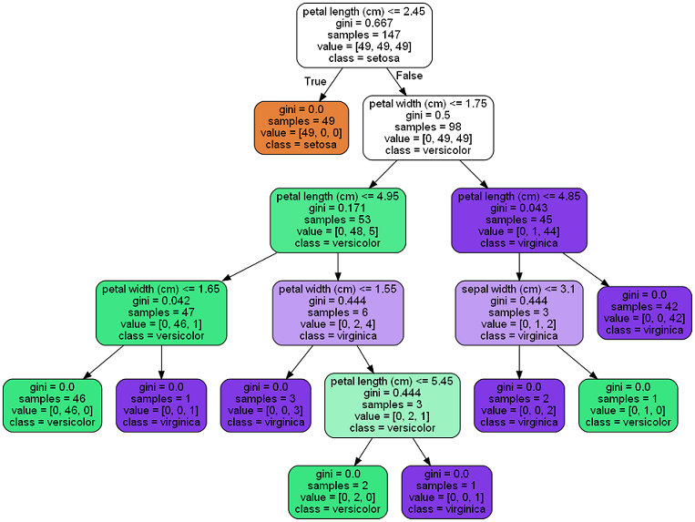

# 02 visualizing a classifier -- a decision tree

We know that the key part of ML is to train a classifier -- to create
a function that contains a box of rules that were learnt from examples.
We'll visualize a classifier to show how it works under the hood:

* how to create rules from examples (subsequent episodes)
* what the rules look like in the box (in the classifier)
* how to classify a new input

The following example shows the ML program trains a classifier for the
Iris flower. It just loads the data set, split into two part: training data
and testing data, train the classifier and then test the classifier with
the testing data.

```python
import numpy as np
from sklearn.datasets import load_iris
from sklearn import tree

iris = load_iris()
test_idx = [0, 50, 100]

# training data
train_data = np.delete(iris.data, test_idx, axis=0)
train_target = np.delete(iris.target, test_idx)

# testing data
test_data = iris.data[test_idx]
test_target = iris.target[test_idx]

clf = tree.DecisionTreeClassifier()
clf.fit(train_data, train_target)

print("the meta data: features and lables")
print(iris.feature_names)
print(iris.target_names)
print("the testing data & target and the prediction from the classifier")
print(test_data, test_target)
print(clf.predict(test_data))
print("the testing data of index 1 to show mechanism manually")
print(test_data[1])
print(test_target[1]

from sklearn.tree import export_graphviz
with open(r".\tree.dot", 'w') as f:
    export_graphviz(clf,
                     out_file=f,
                     feature_names=iris.feature_names[:],
                     class_names=iris.target_names,
                     rounded=True,
                     filled=True)

### the following is to run the program
(base) D:\learning\machine learning\ML recipes\codes>python viz.py
the meta data: features and lables
['sepal length (cm)', 'sepal width (cm)', 'petal length (cm)', 'petal width (cm)']
['setosa' 'versicolor' 'virginica']
the testing data & target and the prediction from the classifier
[[5.1 3.5 1.4 0.2]
 [7.  3.2 4.7 1.4]
 [6.3 3.3 6.  2.5]] [0 1 2]
[0 1 2]
the testing data of index 1 to show mechanism manually
[7.  3.2 4.7 1.4]
1

```

we can convert the dot file to png: "dot -Tpng tree.dot -o tree.png".
from the picture, we can see the structure of the classifier. Each node contains a rule with a
YES or NO question. The "predictor" takes an input, traverses through
the nodes tree and stops in a leaf which gives the result.
For example, for the testing_data[1], we have its petal length -- 4.7 and petal width -- 1.4.
Let's traverse the nodes tree manually:

* pl <= 2.45 ? No  --> goto right
* pw <= 1.75 ? Yes --> goto left
* pl <= 4.95 ? Yes --> goto left
* pw <= 1.65 ? Yes --> goto left and we get the result leaf

we have the label - versicolor -- the same result with the ML program.
The predictor works the same way as the above steps.



[video of this episode](https://www.yxgapp.com/visualizing-a-decision-tree-machine-learning-recipes-2/ "Visualize the decisition tree")
