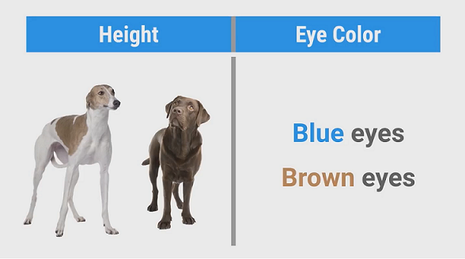
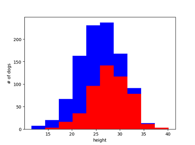
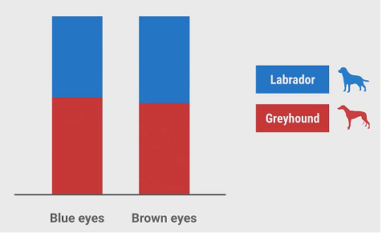

# 03 what makes a good feature

Good features make good classifiers. For the binary classification,
a good feature **make it easy to decide** between two different things.

## Example: tell the difference between greyhounds and Labradors

Let's make assumptions to make things simple:

* greyhounds are usually taller than Labradors
* dogs have only 2 eye colors: dark or brown. And eye color doesn't depend on the bread of dogs



We'll use two features: the dog's height in inches and their eye color. Let's begin with the "height" feature.

```python
import numpy as np
import matplotlib.pyplot as plt

greyhounds = 500
labs = 500

# let's say height is normally distributed
grey_height = 28 + 4 * np.random.randn(greyhounds)
lab_height = 24 + 4 * np.random.randn(labs)

# the histogram shows the number of each type of dogs with a given height
plt.hist([grey_height, lab_height], stacked=True, color=['r', 'b'])
plt.show()
```



With a given hight, the histogram shows the number of each type of dogs.
In other words, you can figure out the probability of the type of dog given their height. For example,

* 18 inches - labrador with probability of 80%
* 25 inches - labrador with probability of 55%
* 35 inches - greyhound with probability of 95%

With a height of 23~28 inches, the probability of each type is close and it is hard to make a prediction.
So height is a **useful** feature, but it's **not perfect**.
You **need more features** to tell them apart, e.g., how fast they can run and/or how much they weigh.
In ML, you almost always need multiple features.(More features give more **information**)
Otherwise, you can just write an if statement instead of bother with classifier. Let's turn to the "eye color" feature.



From the histogram, the probability is very close, the distribution is about 50/50.
So this feature tells us nothing. It doesn't correlate with the type of dog.
**It contains no information**, it's useless.

Including a **useless feature** like this in the training data can **hurt the classifier's accuracy**.
That's because there's a chance they might appear useful purely by accident,
especially when you have only a small amount of training data. For example,
the training dataset may have only 20 samples, with 8 samples of blue eyes are labs by accident.
It will find **some rule** from the eye color feature and generate a classifier that is not accurate.

Sometimes we cannot realize if a feature is useless. It'll hide in the training data and hurt the classifier.
We can collect **enough** training data (avoid "noisy" rules)
with correct sample method (avoid sampling bias), and then draw a histogram to find the "useless" feature.
Even if we do not eliminate the useless feature,
the "plenty" training data will avoid getting "rules" from this feature.

## independent features

We already have the feature "height in inches", now consider adding another feature "height in centimeters".
The new feature gives no more information than the old one. They're the same thing.
If they're both in the training data, it'll **double count how important the feature is**.
It'll hurt classifier's accuracy. We shall avoid this.
We shall write tools to detect these features automatically.

There's a concept "independence". The above example gives a special case of "dependence".
Suppose another situation: there're 3 features, the 3rd one is
a liner conbination of the first two features. So they are not independent,
the importance of first two features is "double counted".
We shall remove the 3rd feature and keep only the "independent" features.
Again, we shall develop tools to detect these features automatically.

**independent features are best features.**
Independent features give completely different type of information.

There's another concept "high correlated". It may happens when
features have information in common. We shall transform them with a liner map
so that there're less features in the feature set and
the new features are all independent. Is there an example?

## Features shall be easy to understand

Imagine you want to predict how many days it will take to mail
a letter between two different cities? The obvious feature is
to use the distance between two cities in miles. The farther apart the
cities are, the longer it will take. It is a simple feature and
is easy to find rules from examples.

There's another choice: we can use the city's location given by
its latitude and longitude. It is complex.
Learning the relationship between latitude, longitude and time
is much harder and require many more examples in the training data.
Besides, the "rules" from examples may be very complex.

## Ideal features

* informative
* independent
* simple

[video of this episode](https://www.yxgapp.com/what-makes-a-good-feature-machine-learning-recipes-3/ "what makes a good feature")
