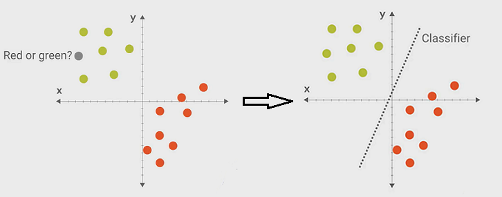
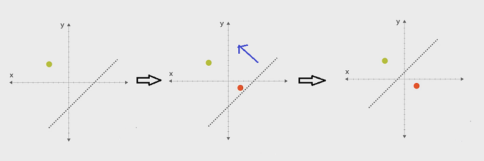

# 04 how a classifier is trained -- how params are adjusted for the model

ML is the study of algorithms that learn from examples and experience - train a classifier.
We will talk about how the classifier is "trained" from the training data.

A classifier is a function to predict the label:

```python
# X -- features, y -- label
f(X) = y

def classifier (features):
    # the body of the function is the rules from examples
    return label
```

We can take the function body (rules) as **a model with parameters**.
For example, ```y=mx+b``` is a line function. To train a classifier
is to adjust the parameters ```m``` and ```b``` in the model to
make sure the model works on the training data.

Let's look at the following issue. How to predict label of the grey dot?
The obvious model is a line: dots on the left of the line belong to one label,
and dots on the right belong to the other label.



The following picture demonstrates how parameters are adjusted while
the training data is entered one by one. After all training
data are consumed, we get the adjusted parameters, thus we get
the model, i.e. the classifier. It works for all training data.
Next step is to verify its accuracy with testing data.



[video of this episode](https://www.yxgapp.com/lets-write-a-pipeline-machine-learning-recipes-4/ "adjust model parameters")
