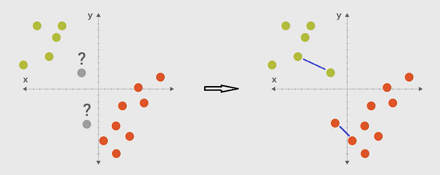

# 05 write a classifier

We have already shown how a classifier works under the hood:

* what the inside looks like and how to classify an input - the decision tree classifier
* how params are adjusted according to the training data - the model based classifier: a line function

Today we will write a classifier from scratch so that we can get deep understanding of it.
Let's think about the following issue. How to classify the grey dots?
The previous method is to train a line model classifier:
dots from left side and right side have different labels.
It is a model based classifier. We will now study the
instance based classifier: find the nearest training data
from the testing data and get the label from that traing data.
The underlying theory is: ***similar data have the same label***.



[video of this episode](https://www.yxgapp.com/writing-our-first-classifier-machine-learning-recipes-5/ "write a nearest neighbor classifier")

It's time to write the code. We shall notice that different
classifiers have the same interfaces -- fit() and predict() function.
We need to write a class that implements these interfaces.
To use the new classifier, just only need to change the factory method.

```python
##########################################################
# the following is the class that implement the 'similarity' classifier
# we just need to implement the interfaces fit() and predict()
from scipy.spatial import distance
def euc(a, b):
    return distance.euclidean(a,b)

class ScrappyKNN():
    def fit(self, X_train, y_train):
        self.X_train = X_train
        self.y_train = y_train

    def predict(self, X_test):
        predictions = []
        for row in X_test :
            label = self.closest(row)
            predictions.append(label)
        return predictions

    # a helper function that get the label of the nearest training data
    def closest(self, row):
        dist = euc(row, self.X_train[0])
        idx = 0
        for i in range(1,len(self.X_train)) :
            d = euc(row, self.X_train[i])
            if d < dist :
                dist = d
                idx = i
        return self.y_train[idx]

##########################################################
# the following is how to use the new classifier to resolve issues:
from sklearn import datasets
iris = datasets.load_iris()

# a classifier is a function f(X) = y
X = iris.data
y = iris.target

from sklearn.model_selection import train_test_split
X_train, X_test, y_train, y_test = train_test_split(X, y, test_size = .5)

# multiple classifiers can resolve the same problems
# just only need to replace the factory method.
# Example 1:
#     from sklearn import tree
#     my_classifier = tree.DecisionTreeClassifier()
# Example 2:
#     from sklearn.neighbors import KNeighborsClassifier
#     my_classifier = KNeighborsClassifier()
my_classifier = ScrappyKNN()

# different classifiers have the same interfaces
my_classifier.fit(X_train, y_train)
predictions = my_classifier.predict(X_test)

# verify the accuracy with testing data
from sklearn.metrics import accuracy_score
print(accuracy_score(y_test, predictions))

# here is to run the script:
(base) D:\learning\machine learning\ML recipes\codes>python similarity.py
0.9466666666666667
```

Our classifier is a variation on the KNeighborsClassifier - k-nearest neighbors.  
Pros

* relatively simple

Cons

* slow -- computationally intensive
* hard to represent relationships between features

some features are more informative than others but kneighbors cannot represent it.
In the long run, we want a classifier that learns
more complex relationship between features and the
label we want to predict. The decision tree does a good job on that.
