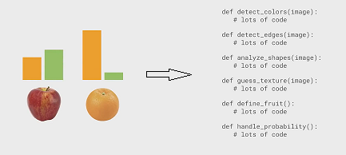
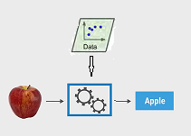

# Machine Learning Tutorial

It's a quick guide of Machine Learning.
From this blog, We'll learn the basic concept and get some intuition.

Lession 1 gives the basic concept of ML and shows how it resolves a problem.  
[Lession 2](./02.md) shows what a ML classifier looks like.  
[Lession 3](./03.md) shows what makes a good feature.  
[Lession 4](./04.md) shows how to train a classifier -- how params are adjusted for the model.  
[Lession 5](./05.md) shows how to code a classifier -- implement the interface fit() and predict()  
[Lession 6](./06.md) code another classifier from scratch -- a decision tree classifier  
[Summary](./summary.md) review the knowledge

## 01 hello world

### what is machine learning

To find a solution for common issues, the traditional method
is that the engineers or scientists study cases in the context,
find rules and then apply rules to the issues.
Machine Learning just makes the ***learning process***
run automatically (without effort from human).

In a word, Machine Learning is a technique that
learns rules from examples automatically.

### An example

how to tell the differece between an apple and an orange?


#### Traditional method

The programmer studies their properties and finds rules
to distinguish them - ratio of green and yellow pixels.
After that, he writes a hard coded program that contains this rule.
The drawbacks:

* have to find rules and write code manually
* can not handle new situations: grey image; images do not contain apples or oranges in them at all
* can not handle new problems (need to re-write the code -- new rules)



To solve this, we need an algorithm that can figure out the rules for us
instead of writing them by hand. That is what ML does.

#### ML method

The ML program finds patterns (rules) from examples **automatically** - it
is a process of training the classifier (in other words, creating a function).
The observed rules can then be used to resolve problems. For example,
to classify an object, the classifier takes the input (the problem), analyzes it (run the function) and then gives an output (type of the fruit).



advantages:

1. no need to write hard-coded rules (ML algorithm trains the classifier)
2. can resolve new situations of this problem (just update the training data)
3. can resolve different problems (no need to be rewritten, just only re-train the classifier with new examples)
4. can resolve problems that cannot be resolved with traditional way
5. the computer runs fast than human and can upgrade constantly.

steps for ML:

1. collect training data (examples of the problem to be resolved)
2. train the classifier (it is what ML does)
3. predict the result via classifier

The training data are examples of the problem to be resolved.
Each example contains features and a label (a piece of description).
The ML algorithm trains the classifier with these examples.
To train a classifier is to create a function that contains
"rules" of the "examples". The function then takes
descriptions(measurement, features) of the problem as input
and gives the result - the label.

```python
# training data:
#
#      feature
#  Weight |  Texture  |  Label
#   150g  |   Bumpy   |  Orange
#   170g  |   Bumpy   |  Orange
#   140g  |   Smooth  |  Apple
#   130g  |   Smooth  |  Apple
```

### programming

```python
from sklearn import tree
# smooth: 0; bumpy: 1;
# orange: 0; apple: 1;
features = [[140, 1], [130, 1], [150, 0], [170, 0]] # collect examples
labels = [0, 0, 1, 1]
clf = tree.DecisionTreeClassifier()  # select the model of the classifier
clf = clf.fit(features, labels)      # train the classifier with examples
print(clf.predict([[150, 0]]))

# the following is to run the program
(base) D:\learning\machine learning\ML recipes\codes>python hello-world.py
[1]
```

[video of this episode](https://www.yxgapp.com/hello-world-machine-learning-recipes-1/ "click here to watch the video")
