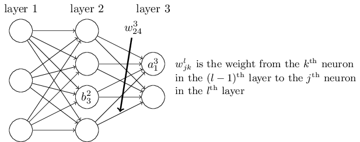

# 05 Backpropagation

There's one thing we did not talk about: how to calculate the partial derivatives?
In other words, how to calculate $$\frac{\partial C_{X_j}}{\partial w}$$ for
the "step" function:

 \begin{eqnarray}
  w & \rightarrow & w' = w-\frac{\eta}{n}
  \sum_j \frac{\partial C_{X_j}}{\partial w}
\end{eqnarray}

I will discuss how to calculate in this class. First begin with some convention:

From the digram, we know the meaning of $$w^{l}_{jk}, \; a^{l}_k, \; b^{l}_k$$.
Besides, we have the formula:

$$a^l_j = \sigma\left(z^l_j \right) \; and \;
  z^l_j = \sum_k w^{l}_{jk} a^{l-1}_k + b^l_j$$

Take the the vectorized form:
$$ a^l = \sigma(z^l) \; and \; z^l \equiv w^l a^{l-1}+b^l$$

## Deriving the Gradients

The reader shall have the math foundation of partial derivatives
and partial derivatives of multivariate functions. Here is the derivation:

$$ \begin{equation*}
\begin{split}
\frac{\partial C}{\partial w^l_{jk}}
&  = \frac{\partial C}{\partial z^l_j}
     \cdot \frac{\partial z^l_j}{\partial w^l_{jk}} \\
&  = \delta^l_j \cdot \frac{\partial}{\partial w^l_{jk}}
     \left( \sum_m w^l_{jm} a^{l-1}_m + b^l_j \right) \\
&  = \delta^l_j \cdot a^{l-1}_k
\end{split}
\end{equation*}
$$

and:

$$ \begin{equation*}
\begin{split}
\delta^l_j
   = \frac{\partial C}{\partial z^l_j}
&  = \sum_m \frac{\partial C}{\partial z^{l+1}_m}
     \cdot \frac{\partial z^{l+1}_m}{\partial z^l_j} \\
&  = \sum_m \delta^{l+1}_m \cdot \frac{\partial}{\partial z^l_j}
    \left( \sum_n w^{l+1}_{mn} \sigma \left(z^l_n \right) + b^{l+1}_m \right) \\
&  = \sum_m \delta^{l+1}_m \cdot w^{l+1}_{mj} \cdot \sigma'(z^l_j) \\
&  = \sigma'(z^l_j) \cdot \sum_m \delta^{l+1}_m w^{l+1}_{mj}
\end{split}
\end{equation*}
$$

## The backpropagation algorithm

We can write the algorithm now:

1. Feedforward: For each l=2,3,…,L compute

    $$z^{l} = w^l a^{l-1}+b^l \; \mbox{and} \; a^{l} = \sigma(z^{l})$$

2. Output error $$\delta^L$$: Compute the vector

    $$\delta^{L} = \nabla_a C \odot \sigma'(z^L)$$

3. Backpropagate the error: For each l=L−1,L−2,…,2 compute:

    $$\delta^{l} = ((w^{l+1})^T \delta^{l+1}) \odot \sigma'(z^{l})$$

4. Output: The gradient of the cost function is given by

    $$\frac{\partial C}{\partial w^l_{jk}} = a^{l-1}_k \delta^l_j \; \mbox{and} \;
      \frac{\partial C}{\partial b^l_j} = \delta^l_j$$
