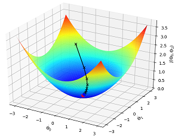

# underlying principles of the deep learning

## Get params of the neurone

As was discussed before, a neurone model contains
params to be learnt from examples. We also showed how
to learn it:

1. give an initial value: $$w_0$$ and $$b_0$$
2. make a small change of `w` and `b` to make
output $$\hat{y}$$ approach the actual value `y` from training data.
In other words, to make $$\|y-\hat{y}\|$$ smaller.
3. repeat the process until the delta is enough small

We can develop a math model for investigation --
a cost function represents that delta:

$$\begin{equation*}
  C(w,b) = \frac{1}{2n} \sum_x \| y(x) - a\|^2
\tag{2-1}\end{equation*}$$

We use the activation `a` as the output $$\hat{y}$$. Our goal is to
***get the smallest `C(w,b)` which depends on value of `w` and `b`***.
How to get it?

## Intuition of the steps of changes

From the equation, we can take the cost function as a curved surface.
We then go step by step from the initial point to the lowest
point: $$C_0(w_0, b_0) ---> C_{smallest}(w, b)$$:

The obvious method is to have a ***big step*** towards the
direction that ***goes down most quickly***.
We give the "step" a name "learning rate" $$\eta$$ and
the direction a name "gradient" (In fact, direction shall
be opposite of "gradient"). The "step" is to be adjusted by experience.
"gradient" is a concept of math.

## deduction with math

The readers shall have basic foundation on
[Total devirative](https://en.wikipedia.org/wiki/Total_derivative) and
[Gradient](https://en.wikipedia.org/wiki/Gradient).
We'll show how to get a step of a point, so that the cost function becomes smaller.

$$
\begin{equation*}
  \Delta C \approx \frac{\partial C}{\partial w} \Delta w +
  \frac{\partial C}{\partial b} \Delta b
\tag{2-2}
\end{equation*}$$
$$\begin{equation*}
  \mbox{gradient: } \; \nabla C \equiv \left( \frac{\partial C}{\partial w},
  \frac{\partial C}{\partial b} \right)^T
\tag{2-3}
\end{equation*}
$$
$$
\begin{equation*}
  \Delta C = \nabla C \cdot \Delta v, \;\;\; v = (w, b)
\tag{2-4}
\end{equation*}$$

We can design a "step" to make the point go towards the lowest direction ***quickly***:

$$\begin{eqnarray}
\Delta v = -\eta \nabla C , \; i.e., \; v \rightarrow v' = v-\eta \nabla C
\tag{2-5}\end{eqnarray}$$

From (2-4) and (2-5) we get $$\Delta C = - \eta \|\nabla C\|^2 < 0$$, i.e.,
the cost function becomes smaller after the step.
***With $$\eta$$, we go with a "big" step; with $$\nabla C$$, we go towards the fast direction to approach the "lowest" point***.
Repeat the process to go to the lowest point.

Before we get to the final equation, let's go back to defination of cost function (2-1).
The cost function is an average of values
that "cost" on every example `x`: $$C = \frac{1}{n} \sum_x C_x$$.
Thus we have $$\nabla C = \frac{1}{n} \sum_x \nabla C_x$$.

Now we come to the final equation:

$$\begin{eqnarray}
  w_k & \rightarrow & w_k' = w_k-\frac{\eta}{n}
  \sum_j \frac{\partial C_{X_j}}{\partial w_k} \\
  
  b_l & \rightarrow & b_l' = b_l-\frac{\eta}{n}
  \sum_j \frac{\partial C_{X_j}}{\partial b_l}
\tag{2-6}\end{eqnarray}$$
