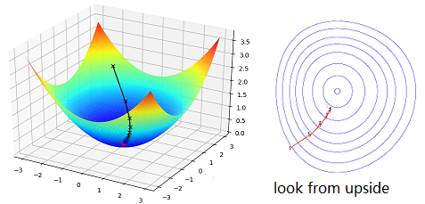

# 02 Underlying Principles

## Model of the cost function

As was discussed before, a neurone model contains
params to be learnt from examples.
We can develop a math model for investigation --
a cost function:

$$\begin{equation*}
  C(w,b) = \frac{1}{2n} \sum_x \| y(x) - \hat{y}\|^2
\tag{2-1}\end{equation*}$$

***Our goal is to get the smallest `C(w,b)` which depends on value of `w` and `b`***.
In other words, our goal is to get appropriate `w` and `b` that can
make a smallest `C(w,b)`. How to get it?

## Intuition of finding smallest cost

From the equation, we can take the cost function as a curved surface.
Then go step by step from the initial point to the point whose cost function is smallest:
$$(w_0, b_0) \rightarrow \cdots \rightarrow (w_m, b_m), \; C_{min} = C(w_m, b_m)$$:

The obvious way is to walk with a ***proper step size*** towards the
direction that ***goes down most quickly***.
We give the "step size" a name ***learning rate $$\eta$$*** and
the direction a name ***gradient descent***.
$$\eta$$ is to be adjusted by experience and "gradient descent"
is a math concept. For the word "proper", I mean that we can choose
a proper $$\eta$$ so that the point can walk with a big step size.
If we look from upside, the movement looks like the following:

## Get the step equation

The readers shall have basic foundation on
[Total devirative](https://en.wikipedia.org/wiki/Total_derivative) and
[Gradient](https://en.wikipedia.org/wiki/Gradient).
We'll show how to get a "step" of a point, so that the cost function becomes smaller.

$$
\begin{equation*}
  \Delta C \approx \frac{\partial C}{\partial w} \Delta w +
  \frac{\partial C}{\partial b} \Delta b
\tag{2-2}
\end{equation*}$$
$$\begin{equation*}
  \mbox{gradient: } \; \nabla C \equiv \left( \frac{\partial C}{\partial w},
  \frac{\partial C}{\partial b} \right)^T
\tag{2-3}
\end{equation*}
$$
$$
\begin{equation*}
  \Delta C = \nabla C \cdot \Delta v, \;\;\; v = (w, b)
\tag{2-4}
\end{equation*}$$

We can design a "step size" to make the point walk towards the lowest point ***quickly***:

$$\begin{eqnarray}
\Delta v = -\eta \nabla C , \; i.e., \; v \rightarrow v' = v-\eta \nabla C
\tag{2-5}\end{eqnarray}$$
$$\begin{eqnarray}
\Delta C = - \eta \|\nabla C\|^2 < 0
\tag{2-6}\end{eqnarray}$$

***With $$\eta$$, the point walks with a proper step size; with $$\nabla C$$, it walks towards the fast direction to approach the "lowest" point***.
The cost function becomes smaller after the step.
Repeat the process to go to the lowest point.

Before we get to the final equation, let's go back to defination of cost function (2-1).
The cost function is an average of values
that "cost" on every example: $$C = \frac{1}{n} \sum_x C_x$$.
Thus we have $$\nabla C = \frac{1}{n} \sum_x \nabla C_x$$.
Now we have the step equation:

$$\begin{eqnarray}
  w_k & \rightarrow & w_k' = w_k-\frac{\eta}{n}
  \sum_j \frac{\partial C_{X_j}}{\partial w_k} \\
  
  b_l & \rightarrow & b_l' = b_l-\frac{\eta}{n}
  \sum_j \frac{\partial C_{X_j}}{\partial b_l}
\tag{2-7}\label{eq:step}\end{eqnarray}$$

## Algrithm

Now we come to the final algrithm:

1. take intial values: $$w_0, \; b_0$$
2. with the step equation $$\eqref{eq:step}$$, walks one step each time to get a smaller cost function
3. repeat the process until the cost is small enough
