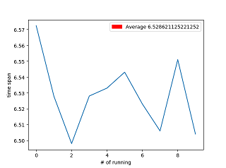

# 04 Implementation

It's time to implement the function. Before that,
we need to download the data set MNIST. It contains
70000 images and each of them is a handwritten digit.
These digits are used for training and testing.

where to download: [MNIST Database (mnist.pkl.gz) - Academic Torrents](https://academictorrents.com/details/323a0048d87ca79b68f12a6350a57776b6a3b7fb)

The code is in the git repo [machine learning](https://github.com/hzget/machine-learning).
It is self-explained so I will not give too much redundant detail.
Just give the usage.

Note: math of the backpropagation will be introduced in next chapter.
Thus you can bypass this code section and go back after learning its math principle.

## Usage of the lib

### Load the data set

```python
>>> import mnist_loader
>>> training_data, validation_data, test_data = \
... mnist_loader.load_data_wrapper()
```

### Examine the data structure

Before consuming the training data, let's examine the data structure
so that we can use the lib in a proper way.

```python
>>> type(training_data)
<class 'list'>
>>> len(training_data)
50000
>>> type(training_data[0])
<class 'tuple'>
>>> len(training_data[0])
2
>>> type(training_data[0][0])
<class 'numpy.ndarray'>
>>> type(training_data[0][1])
<class 'numpy.ndarray'>
>>>
>>> len(training_data[0][0])
784
>>> len(training_data[0][1])
10
```

It seems each training_data contains the inputs - intensity of 784 pixels
and an array with len of 10.

```python
>>> training_data[0][1]
array([[0.],
       [0.],
       [0.],
       [0.],
       [0.],
       [1.],
       [0.],
       [0.],
       [0.],
       [0.]])
>>>
```

Only one item in the array is '1'.
It seems its index represent the digit on the image.

```python
>>> type(test_data)
<class 'list'>
>>> len(test_data)
10000
>>> type(test_data)
<class 'list'>
>>> type(test_data[0])
<class 'tuple'>
>>> len(test_data[0])
2
>>> type(test_data[0][0])
<class 'numpy.ndarray'>
>>> type(test_data[0][1])
<class 'numpy.int64'>
>>> len(test_data[0][0])
784
>>> test_data[0][1]
7
>>> test_data[99][1]
9
>>> test_data[199][1]
2
```

The testing data structure looks similar with training data structure
except that a testing data contains its "label" (the digit), not an array.

### Train the neural network

```python
>>> import network
>>> net = network.Network([784, 30, 10])
>>> net.SGD(training_data, 30, 10, 3.0, test_data=test_data)
```

It constructs the neural network with layers of 784-30-10.
It's params:

* repeat times: 30
* size of the mini-batch: 10
* learning rate: 3

### Check the performance

```python
Epoch 0: 9103 / 10000
Epoch 1: 9247 / 10000
Epoch 2: 9282 / 10000
Epoch 3: 9355 / 10000
Epoch 4: 9391 / 10000
Epoch 5: 9376 / 10000
Epoch 6: 9384 / 10000
Epoch 7: 9449 / 10000
Epoch 8: 9418 / 10000
Epoch 9: 9432 / 10000
Epoch 10: 9466 / 10000
Epoch 11: 9450 / 10000
Epoch 12: 9434 / 10000
Epoch 13: 9461 / 10000
Epoch 14: 9471 / 10000
Epoch 15: 9446 / 10000
Epoch 16: 9461 / 10000
Epoch 17: 9483 / 10000
Epoch 18: 9471 / 10000
Epoch 19: 9507 / 10000
Epoch 20: 9486 / 10000
Epoch 21: 9484 / 10000
Epoch 22: 9494 / 10000
Epoch 23: 9485 / 10000
Epoch 24: 9493 / 10000
Epoch 25: 9488 / 10000
Epoch 26: 9491 / 10000
Epoch 27: 9504 / 10000
Epoch 28: 9502 / 10000
Epoch 29: 9499 / 10000
```

The performance improves after trying many times.
The best performance is in Epoch 19.

### An example to predict

```python
>>> net.feedforward(test_data[0][0])
array([[3.49241328e-09],
       [2.34505644e-07],
       [5.12237559e-05],
       [4.30536109e-04],
       [1.53056029e-06],
       [1.18577488e-10],
       [3.43211556e-12],
       [9.99996956e-01],      ---- the max value
       [2.32973706e-07],
       [1.44258080e-08]])
>>>
>>> test_data[0][1]
7

test_data[0][0] is taken as inputs and the output is the prediction.
The prediction is equal to the actual "label" from the testing data.

>>> import numpy as np
>>> np.argmax(net.feedforward(test_data[0][0]))
7
>>> test_data[199][1]
2
>>> np.argmax(net.feedforward(test_data[199][0]))
2
>>>  
```

## time performance

Checking time performance is a good way to verify our improvement each time
when we optimize the code.

I write a script tool to check time performance of the function SGD().
It just runs 10 times and with each time it runs one epoch.
Its params for the following are:  
mini-batch = 10  
learning rate = 3

```python
(base) D:\proj\machine-learning\dl_tutorial>python spantime.py
Epoch 0: 8146 / 10000
Epoch 0: 8321 / 10000
Epoch 0: 8387 / 10000
Epoch 0: 8448 / 10000
Epoch 0: 8429 / 10000
Epoch 0: 8449 / 10000
Epoch 0: 9434 / 10000
Epoch 0: 9449 / 10000
Epoch 0: 9437 / 10000
Epoch 0: 9443 / 10000
[6.572347164154053, 6.527853012084961, 6.497987270355225, 6.528003931045532, 6.532996416091919, 6.54304575920105, 6.522977113723755, 6.505988836288452, 6.550999164581299, 6.504012584686279] 6.528621125221252

(base) D:\proj\machine-learning\dl_tutorial>
```

It draws a picture:


