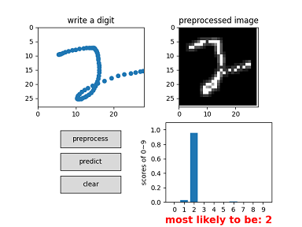
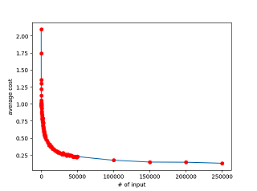

# 04 Implementation

It's time to implement the function. Before that,
we need to download the data set MNIST. It contains
70000 images and each of them is a handwritten digit.
These digits are used for training and testing.

where to download: [MNIST Database (mnist.pkl.gz) - Academic Torrents](https://academictorrents.com/details/323a0048d87ca79b68f12a6350a57776b6a3b7fb)

The code is in the git repo [machine learning](https://github.com/hzget/machine-learning).
It is self-explained so I will not give too much redundant detail.
Just give the usage.

Note: math of the backpropagation will be introduced in next chapter.
Thus you can bypass this code section and go back after learning its math principle.

## GUI interface: online handwrite test

The following is an implementation of the online handwrite test.
(It uses default model "my_model.pkl" trained by
the command "python train_model.py".)

```python
> python test_online.py
```



## CLI interface: test image of digit

The following command just predict the digit of the default image in 'pic/digit.png'.

```python
> python test_image.py
scores of the digits 0~9:
 [[2.73679845e-11]
 [3.31265182e-08]
 [9.99944508e-01]
 [1.53740222e-11]
 [5.78165936e-07]
 [9.92570802e-11]
 [2.66445137e-07]
 [1.47497477e-05]
 [5.54896149e-07]
 [1.78630262e-04]]
most likely to be: 2
```

## CLI interface: Usage of the lib

### Load the data set

```python
>>> import mnist_loader
>>> training_data, validation_data, test_data = \
... mnist_loader.load_data_wrapper()
```

### Examine the data structure

Before consuming the training data, let's examine the data structure
so that we can use the lib in a proper way.

```python
>>> type(training_data)
<class 'list'>
>>> len(training_data)
50000
>>> type(training_data[0])
<class 'tuple'>
>>> len(training_data[0])
2
>>> type(training_data[0][0])
<class 'numpy.ndarray'>
>>> type(training_data[0][1])
<class 'numpy.ndarray'>
>>>
>>> len(training_data[0][0])
784
>>> len(training_data[0][1])
10
```

It seems each training_data contains the inputs - intensity of 784 pixels
and an array with len of 10.

```python
>>> training_data[0][1]
array([[0.],
       [0.],
       [0.],
       [0.],
       [0.],
       [1.],
       [0.],
       [0.],
       [0.],
       [0.]])
>>>
```

Only one item in the array is '1'.
It seems its index represent the digit on the image.

```python
>>> type(test_data)
<class 'list'>
>>> len(test_data)
10000
>>> type(test_data)
<class 'list'>
>>> type(test_data[0])
<class 'tuple'>
>>> len(test_data[0])
2
>>> type(test_data[0][0])
<class 'numpy.ndarray'>
>>> type(test_data[0][1])
<class 'numpy.int64'>
>>> len(test_data[0][0])
784
>>> test_data[0][1]
7
>>> test_data[99][1]
9
>>> test_data[199][1]
2
```

The testing data structure looks similar with training data structure
except that a testing data contains its "label" (the digit), not an array.

### Train the neural network

```python
>>> import network
>>> net = network.Network([784, 30, 10])
>>> net.SGD(training_data, 30, 10, 3.0, test_data=test_data)
```

It constructs the neural network with layers of 784-30-10.
It's params:

* repeat times: 30
* size of the mini-batch: 10
* learning rate: 3

### Check the performance

```python
Epoch 0: 9103 / 10000
Epoch 1: 9247 / 10000
Epoch 2: 9282 / 10000
Epoch 3: 9355 / 10000
Epoch 4: 9391 / 10000
Epoch 5: 9376 / 10000
Epoch 6: 9384 / 10000
Epoch 7: 9449 / 10000
Epoch 8: 9418 / 10000
Epoch 9: 9432 / 10000
Epoch 10: 9466 / 10000
Epoch 11: 9450 / 10000
Epoch 12: 9434 / 10000
Epoch 13: 9461 / 10000
Epoch 14: 9471 / 10000
Epoch 15: 9446 / 10000
Epoch 16: 9461 / 10000
Epoch 17: 9483 / 10000
Epoch 18: 9471 / 10000
Epoch 19: 9507 / 10000
Epoch 20: 9486 / 10000
Epoch 21: 9484 / 10000
Epoch 22: 9494 / 10000
Epoch 23: 9485 / 10000
Epoch 24: 9493 / 10000
Epoch 25: 9488 / 10000
Epoch 26: 9491 / 10000
Epoch 27: 9504 / 10000
Epoch 28: 9502 / 10000
Epoch 29: 9499 / 10000
```

The performance improves after trying many times.
The best performance is in Epoch 19.

### An example to predict

```python
>>> net.feedforward(test_data[0][0])
array([[3.49241328e-09],
       [2.34505644e-07],
       [5.12237559e-05],
       [4.30536109e-04],
       [1.53056029e-06],
       [1.18577488e-10],
       [3.43211556e-12],
       [9.99996956e-01],      ---- the max value
       [2.32973706e-07],
       [1.44258080e-08]])
>>>
>>> test_data[0][1]
7

test_data[0][0] is taken as inputs and the output is the prediction.
The prediction is equal to the actual "label" from the testing data.

>>> import numpy as np
>>> np.argmax(net.feedforward(test_data[0][0]))
7
>>> test_data[199][1]
2
>>> np.argmax(net.feedforward(test_data[199][0]))
2
>>>  
```

## cost performance

We train the neural network using mini-batch stochastic gradient descent.
For example, consume first 10 examples (samples) from training set
to "adjust" the params and then consume next 10 examples
to "adjust" the params in previous step and move on util
consuming all the data. After all examples are consumed,
the rules are learnt -- the adjusted params contains the rules.
In fact, the cost function moves from one point towards lower one
in the process of learning. If we run the process again,
the cost function will go down accordingly.

After each adjustment, we can get the cost value.
For one sample, get the diff of its predicted result and
the label in the training data. And then get the norm of the diff.
After that, average the value of all samples.
From the result we can find that the first 7 points (about 70 examples)
move down quickly.

```python
(base) D:\proj\machine-learning\dl_tutorial>python check_costs.py
Epoch 0: initial average cost 2.0957424218157428
Epoch 0 count 10: updated average cost 1.7439818300725332
Epoch 0 count 20: updated average cost 1.3532854197310502
Epoch 0 count 30: updated average cost 1.2982101070378387
Epoch 0 count 40: updated average cost 1.218452896900201
Epoch 0 count 50: updated average cost 1.1206892641045965
Epoch 0 count 60: updated average cost 1.0538241701665976
Epoch 0 count 70: updated average cost 1.0293428236384916
Epoch 0 count 80: updated average cost 1.018684393074763
Epoch 0 count 90: updated average cost 1.0117557258666785
Epoch 0 count 100: updated average cost 1.005255957652576
Epoch 0 count 110: updated average cost 0.9996249278107859
Epoch 0 count 120: updated average cost 0.9985507188069835
Epoch 0 count 130: updated average cost 0.9985162068856857
...
Epoch 0 count 47000: updated average cost 0.2240201392039186
Epoch 0 count 48000: updated average cost 0.22742225890566345
Epoch 0 count 49000: updated average cost 0.21618775671695706
Epoch 0 count 50000: updated average cost 0.2252645995655769
Epoch 0: updated average cost 0.2252645995655769
Epoch 0: 9082 / 10000
Epoch 1: updated average cost 0.17146706173153295
Epoch 1: 9231 / 10000
Epoch 2: updated average cost 0.144790093686286
Epoch 2: 9299 / 10000
Epoch 3: updated average cost 0.14262610226121752
Epoch 3: 9334 / 10000
Epoch 4: updated average cost 0.12740396485430303
Epoch 4: 9378 / 10000

(base) D:\proj\machine-learning\dl_tutorial>
```

It draws a picture:



## time performance

Checking time performance is a good way to verify our improvement each time
when we optimize the code.

I write a script tool to check time performance of the function SGD().
It just runs 10 times and with each time it runs one epoch.
Its params for the following are:  
mini-batch = 10  
learning rate = 3

```python
(base) D:\proj\machine-learning\dl_tutorial>python spantime.py
Epoch 0: 8146 / 10000
Epoch 0: 8321 / 10000
Epoch 0: 8387 / 10000
Epoch 0: 8448 / 10000
Epoch 0: 8429 / 10000
Epoch 0: 8449 / 10000
Epoch 0: 9434 / 10000
Epoch 0: 9449 / 10000
Epoch 0: 9437 / 10000
Epoch 0: 9443 / 10000
[6.572347164154053, 6.527853012084961, 6.497987270355225, 6.528003931045532, 6.532996416091919, 6.54304575920105, 6.522977113723755, 6.505988836288452, 6.550999164581299, 6.504012584686279] 6.528621125221252

(base) D:\proj\machine-learning\dl_tutorial>
```

It draws a picture:


