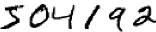
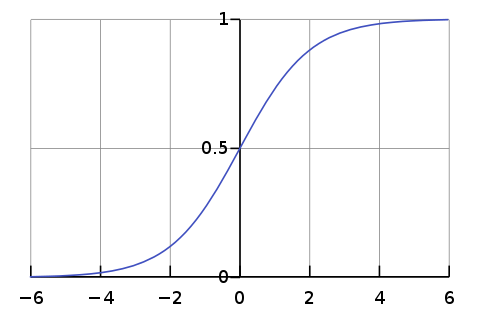

# Neural Networks and Deep Learning

This is a tutorial about deep learning, the 2nd part of the series.

I start the investigation of deep learning from a blog
[Neural Networks and Deep Learning](http://neuralnetworksanddeeplearning.com/index.html)
and record what I get & think during the progress.

Lession 1: Neural Nets  
[Lession 2](./cost_function_math.md) Underlying Principles

## Intro

From the [Machine Learning Tutorial](../ml_tutorials/ml_tutorials.md), we know that
the ML app learns rules from examples and create a classifier
containing these rules. And then it can predict new input.

Deep learning is a model-based ML algrithm that
works as follows: it adjusts its params so that
the training data "works" on it --- rules are learnt.
Thus the model with the adjusted params contains rules from examples.

We will discuss the model in deep learning: neural networks.
And resove only one problem via it: recognize the handwritten digits:  

I will write code from scratch and talk about some math principles.
But I will not spend much time on some details because its a brief tutorial.
Programmers shall be able to fill in the gap.

## 01 Neural Nets

[Deep learning](https://en.wikipedia.org/wiki/Deep_learning)
(also known as deep structured learning) is part of a broader family of
machine learning methods based on **artificial neural networks**
with representation learning.

Thus we will begin from the concept of neuron.

### how neuron works

A neuron or nerve cell is an electrically excitable cell
that receives signals and make some response.

Deep learning make use of that structure to make some prediction.

### perceptron

A [perceptron](https://en.wikipedia.org/wiki/Perceptron)
takes several binary inputs and produces a single binary output.

We can give its math description:

$$\begin{equation*}
  \mbox{output} =
    \begin{cases}
      1 & \text{if } w\cdot x + b > 0 \\
      0 & \mbox{otherwise}
    \end{cases}
\tag{1-1}\end{equation*}$$

The model tells how each input affects the output.
***The params `w` and `b` are what to "learn" from examples.***
With that, the model can predict new input.
Do you know how to "learn" from the training data?

With the training data, we can make a small change
$$\Delta w$$ and $$\Delta b$$ to make $$\|y - \hat{y}\|$$ smaller.
Then repeat the process until we get a good result.

However, this isn't what happens when our network contains perceptrons.
Perceptron is a "step function", its output is a binary value.
A small change $$\Delta w$$ or $$\Delta b$$ may make output jump from 0 to 1 or from 1 to 0.
The "small change" is not possible for the output. It is not expected.

### Sigmoid neurons

Sigmoid neurons is the solution for that.

$$\begin{eqnarray}
  \sigma(z) = \frac{1}{1+e^{-z}} \;\; and \;\; z = w \cdot x+b
\tag{1-2}\end{eqnarray}$$

Its shape is a ***smoothed*** out version of a step function. And it makes the "small change" possible.

