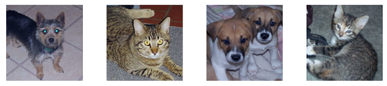

# Transfer learning

People usually create models based on a well-known
pre-trained model instead of training a new model from scratch.
***Transfer Learning*** does this job.
It transfers some knowledge from one
neural netork model to another.

Specifically,

* start with a pre-trained model (on some large generic dataset)
* build a new model on top of "info" from pre-trained model
* train the new model with dataset

## Features

The pre-trained model usually consists of a feature extractor
and a final classifier. When we input a new object,
"feature extractor" tells which ***features*** to collect
and then final classifier tells the correspondence
between feature conbinations and class labels.

In other words, "feature extractor" is a map function
from dataset space to the feature space, while "final classifier"
is a map function from feature space to class space.

## Training

### Two scenarios

There're two major transfer learning scenarios as follows:

***Finetuning the convnet*** : Instead of random initialization,
we initialize the network with a pretrained network,
like the one that is trained on imagenet 1000 dataset.
Rest of the training looks as usual.

***ConvNet as fixed feature extractor*** :
Here, we will freeze the weights for all of the
network except that of the final fully connected layer.
This last fully connected layer is replaced with a new one
with random weights and only this layer is trained.

The following sections give detail steps for these two scenarios.

### create a new model

The pre-trained model can extract features from examples (i.e., dataset)
and these features can be used as ***examples*** from which to
learn rules.

* load the pre-trained model
  * use "feature extractor" component to extract features from dataset
* create a new classifier model
  * train the new model on top of these features
* predict new cases
  * use "feature extractor" component to extract features from new cases
  * the classifer applies the learned rules to these features

### reuse the pre-trained model

The previous method needs to extract features manually.
We can avoid these steps by re-using the pre-trained model.

* load the pre-trained model, and
  * replace its final classifier with a new classifier
  * freeze weights of the convolutional feature extractor to avoid re-training
* the original dataset flow through the pre-trained model
  * the input data flow through "feature extractor" and get the "features"
  * these "features" flow through the new classifier to train it

### re-train the feature extractor and classifier

The previous methods train a new classifier on top of
the dataset features extracted via "fixed feature extractor".

However, this feature extractor was trained from the generic dataset
of the pre-trained model. If our object is quite different
from that of the generic dataset, we need to re-train the feature-extractor,
i.e., the feature space/map needs to be updated.

## Examples

We'll give an example of transfer learning. It's a classifier
model to distinguish between cats and dogs. Just make use of
the fixed feature extractor of a pre-trained model and then
train a new classifier with a dataset.

***dataset*** [Kaggle Cats vs. Dogs Dataset][Kaggle Cats vs. Dogs Dataset]

***pre-trained model*** VGG-16 model

[Kaggle Cats vs. Dogs Dataset]: https://www.kaggle.com/c/dogs-vs-cats

* load a pre-trained model and make some changes

```python
import torch
import torchvision

# load the pre-trained model
vgg = torchvision.models.vgg16(pretrained=True)

# choose gpu or cpu
device = 'cuda' if torch.cuda.is_available() else 'cpu'

# replace the final classifier
vgg.classifier = torch.nn.Linear(25088,2).to(device)

# freeze weights paras of the feature extractor to avoid re-training
for x in vgg.features.parameters():
    x.requires_grad = False
```

Inspect the model structure:

```python
from torchinfo import summary
summary(vgg,(1, 3,244,244))
```

The output:

```python
Out[2]: 
==========================================================================================
Layer (type:depth-idx)                   Output Shape              Param #
==========================================================================================
VGG                                      --                        --
├─Sequential: 1-1                        [1, 512, 7, 7]            --
│    └─Conv2d: 2-1                       [1, 64, 244, 244]         (1,792)
│    └─ReLU: 2-2                         [1, 64, 244, 244]         --
│    └─Conv2d: 2-3                       [1, 64, 244, 244]         (36,928)
│    └─ReLU: 2-4                         [1, 64, 244, 244]         --
│    └─MaxPool2d: 2-5                    [1, 64, 122, 122]         --
│    └─Conv2d: 2-6                       [1, 128, 122, 122]        (73,856)
│    └─ReLU: 2-7                         [1, 128, 122, 122]        --
│    └─Conv2d: 2-8                       [1, 128, 122, 122]        (147,584)
│    └─ReLU: 2-9                         [1, 128, 122, 122]        --
│    └─MaxPool2d: 2-10                   [1, 128, 61, 61]          --
│    └─Conv2d: 2-11                      [1, 256, 61, 61]          (295,168)
│    └─ReLU: 2-12                        [1, 256, 61, 61]          --
│    └─Conv2d: 2-13                      [1, 256, 61, 61]          (590,080)
│    └─ReLU: 2-14                        [1, 256, 61, 61]          --
│    └─Conv2d: 2-15                      [1, 256, 61, 61]          (590,080)
│    └─ReLU: 2-16                        [1, 256, 61, 61]          --
│    └─MaxPool2d: 2-17                   [1, 256, 30, 30]          --
│    └─Conv2d: 2-18                      [1, 512, 30, 30]          (1,180,160)
│    └─ReLU: 2-19                        [1, 512, 30, 30]          --
│    └─Conv2d: 2-20                      [1, 512, 30, 30]          (2,359,808)
│    └─ReLU: 2-21                        [1, 512, 30, 30]          --
│    └─Conv2d: 2-22                      [1, 512, 30, 30]          (2,359,808)
│    └─ReLU: 2-23                        [1, 512, 30, 30]          --
│    └─MaxPool2d: 2-24                   [1, 512, 15, 15]          --
│    └─Conv2d: 2-25                      [1, 512, 15, 15]          (2,359,808)
│    └─ReLU: 2-26                        [1, 512, 15, 15]          --
│    └─Conv2d: 2-27                      [1, 512, 15, 15]          (2,359,808)
│    └─ReLU: 2-28                        [1, 512, 15, 15]          --
│    └─Conv2d: 2-29                      [1, 512, 15, 15]          (2,359,808)
│    └─ReLU: 2-30                        [1, 512, 15, 15]          --
│    └─MaxPool2d: 2-31                   [1, 512, 7, 7]            --
├─AdaptiveAvgPool2d: 1-2                 [1, 512, 7, 7]            --
├─Linear: 1-3                            [1, 2]                    50,178
==========================================================================================
Total params: 14,764,866
Trainable params: 50,178
Non-trainable params: 14,714,688
Total mult-adds (G): 17.99
==========================================================================================
Input size (MB): 0.71
Forward/backward pass size (MB): 128.13
Params size (MB): 59.06
Estimated Total Size (MB): 187.91
==========================================================================================
```

* load dataset and transform to tensor

```python
from pytorchcv import load_cats_dogs_dataset, train_long

# load dataset and transform to tensors
# we only take 500 examples because of low compute power
dataset, train_loader, test_loader = load_cats_dogs_dataset(size=500)

# train the final classifier
train_long(vgg,train_loader,test_loader,loss_fn=torch.nn.CrossEntropyLoss(),epochs=1,print_freq=5)
```

following is the logs

```python
Epoch 0, minibatch 0: train acc = 0.5, train loss = 0.055702149868011475
Epoch 0, minibatch 5: train acc = 0.71875, train loss = 0.36632664998372394
Epoch 0, minibatch 10: train acc = 0.8181818181818182, train loss = 0.28351831436157227
Epoch 0, minibatch 15: train acc = 0.859375, train loss = 0.20987510681152344
Epoch 0, minibatch 20: train acc = 0.8809523809523809, train loss = 0.17787195387340726
Epoch 0, minibatch 25: train acc = 0.8990384615384616, train loss = 0.15166451380803034
Epoch 0 done, validation acc = 0.9977777777777778, validation loss = 0.002446426020728217
```

Let's examine the first 4 images in the dataset.

```python
from pytorchcv import display_dataset
import matplotlib.pyplot as plt

# display first 4 images
plt.ion()
display_dataset(dataset, n=4)
```



```python
# check dataset
sample_images = [dataset[i][0].unsqueeze(0) for i in range(4)]
sample_labels = [dataset[i][1] for i in range(4)]
print(sample_labels)
# the output
[1, 0, 1, 0]
```

As we can see, the label 1 and 0 represent dog and cat respectively.

```python
res = vgg(sample_images[0])
print(res, res[0].argmax().item())
# output
tensor([[-118.0260,  117.9301]], grad_fn=<AddmmBackward0>) 1
```

As we can see, the model vgg get a correct prediction.