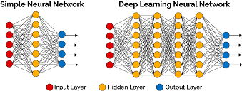

# 03 Some Thought on Neural Nets/Network

We have already shown how a neural net works in deep learning.
But there're some issues with the model and the algrithm.
We'll disscuss more on that. Some of the questions, I have
no idea currently. But I will have an investigation after some time.

## layers in neural networks

Let's go back to the problem to resolve: recognize handwritten digits.
Suppose one image contains only one digit and the image has 28 x 28 pixels.
A simple design is that: there're 784 inputs and 10 output in the network.
We can say that the network contains two layers: input layer and output layer.
There're `w` with dim of 10 x 784 and `b` with dim of 10 to be resolved.

It works but not with a high performance. Engineers'd like to add
some "hidden" layers to get a good performance. It seems more layers
works better than 2-layers networks. Why? It's question to discuss
in the future.

## cost function

From the previous discussion, we will use a quadratic
cost function $$\frac{1}{2n} \sum_x \| y(x) - \hat{y}\|^2$$. It is usually
called Mean Square Error MSE. Why not use the form of
Mean Absolute Error MAE:$$\frac{1}{n} \sum_x \| y(x) - \hat{y}\|$$, or
some other forms?

Let's disscuss it in the future.

## stochastic gradient descent

We have given the step equation for the point `(w, b)` so that it
walks towards the point that has smallest cost value. With the
training data, the $$\nabla C$$ are calculated. It works when the training
data set is small. But deep learning needs plenty of training
data for a good performance. Thus the algrithm will work but
very slow. And speed may be not accepted in some situation.

How to speed up the process? ***stochastic gradient descent*** is
a good idea. It just pick a small set of training data for training. Just
call the small set the "mini-batch".
The idea is to estimate the gradient $$\nabla C$$ by computing $$\nabla C_x$$ for
a small sample of randomly chosen training inputs. By averaging
over this small sample it turns out that we can quickly get
a good estimate of the true gradient $$\nabla C$$, and this helps
speed up gradient descent, and thus learning.

why can it work?
