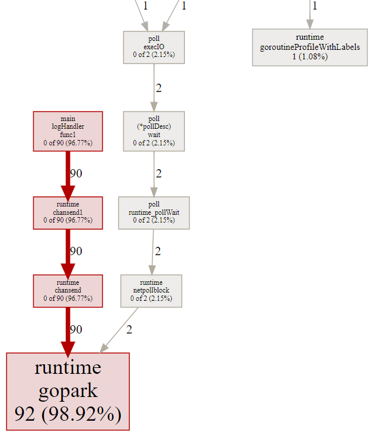
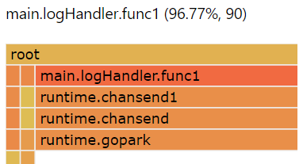
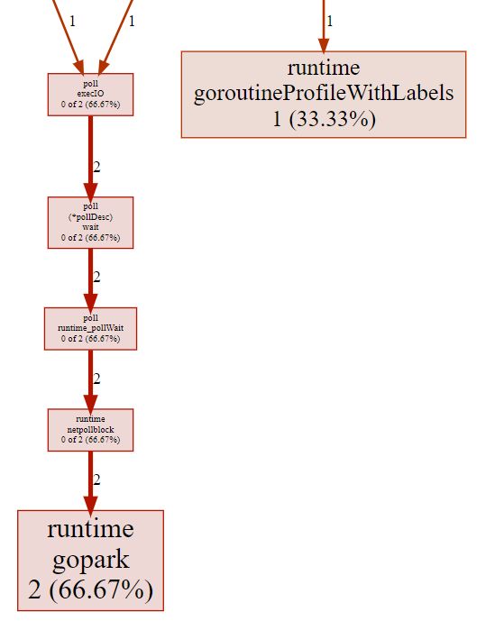
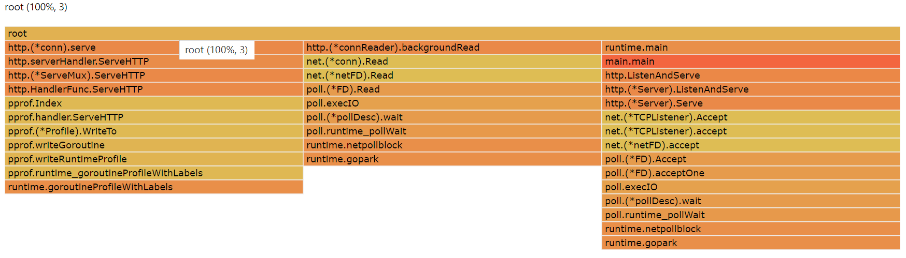

# Find goroutine leak via pprof

[up &uarr; profiling](./profile.md)

The following is an example of finding goroutine leaks via [pprof][diagnistics profiling].
It examines the issue from different points of views.

main.go is a http server containing goroutine leak.
Each time `logHandler` handles the request, there's a probability
that timeout comes earlier than when the db operation is finished. In this case,
the handler goroutine exit whereas db operation goroutine blocks for ever
(because the channel send operation blocks for ever).

We'll use [hey][hey] to simulate http loads.

```golang
  1 package main
  2
  3 import (
  4         "encoding/json"
  5         "math/rand"
  6         "net/http"
  7         _ "net/http/pprof"
  8         "time"
  9 )
 10
 11 func main() {
 12         http.HandleFunc("/log", logHandler)
 13         http.ListenAndServe(":6060", nil)
 14 }
 15
 16 func logHandler(w http.ResponseWriter, r *http.Request) {
 17         ch := make(chan int)
 18         go func() {
 19                 obj := struct {
 20                         user string
 21                         age  int
 22                 }{}
 23                 if err := json.NewDecoder(r.Body).Decode(&obj); err != nil {
 24                         ch <- http.StatusBadRequest
 25                         return
 26                 }
 27                 // simulation of a time consuming process like writing logs into db
 28                 time.Sleep(time.Duration(rand.Intn(400)) * time.Millisecond)
 29                 ch <- http.StatusOK
 30         }()
 31
 32         select {
 33         case status := <-ch:
 34                 w.WriteHeader(status)
 35         case <-time.After(200 * time.Millisecond):
 36                 w.WriteHeader(http.StatusRequestTimeout)
 37         }
 38 }
```

```golang
# simulate http load
> hey -d "{\"user\":\"Jack\", \"age\":17}" http://localhost:6060/log
...
...
Status code distribution:
  [200] 110 responses
  [408] 90 responses        <----------- 90 responses with "408 Request Timeout"
```

We will profile the run-time application and check if there's any
goroutine leaks.

```bash
# generate goroutine profile
> curl -o goroutine.pb.gz http://localhost:6060/debug/pprof/goroutine
  % Total    % Received % Xferd  Average Speed   Time    Time     Time  Current
                                 Dload  Upload   Total   Spent    Left  Speed
100  1366  100  1366    0     0  40456      0 --:--:-- --:--:-- --:--:-- 41393

# interactive mode
> go tool pprof main.exe goroutine.pb.gz
File: main.exe
Type: goroutine
Time: Mar 4, 2023 at 11:20pm (CST)
Entering interactive mode (type "help" for commands, "o" for options)
(pprof) top
Showing nodes accounting for 93, 100% of 93 total <----- too many running goroutines
Showing top 10 nodes out of 33
      flat  flat%   sum%        cum   cum%
        92 98.92% 98.92%         92 98.92%  runtime.gopark
         1  1.08%   100%          1  1.08%  runtime.goroutineProfileWithLabels
         0     0%   100%          1  1.08%  internal/poll.(*FD).Accept
         0     0%   100%          1  1.08%  internal/poll.(*FD).Read
         0     0%   100%          1  1.08%  internal/poll.(*FD).acceptOne
         0     0%   100%          2  2.15%  internal/poll.(*pollDesc).wait
         0     0%   100%          2  2.15%  internal/poll.execIO
         0     0%   100%          2  2.15%  internal/poll.runtime_pollWait
         0     0%   100%         90 96.77%  main.logHandler.func1     <----- 90 goroutines unexpected -- leaks
         0     0%   100%          1  1.08%  main.main
(pprof) q

# get an interactive web interface
> go tool pprof -http localhost:6061 goroutine.pb.gz
Serving web UI on http://localhost:6061

# visit http://localhost:6061/ui/peek
# result:
      Type: goroutine
Time: Mar 4, 2023 at 11:20pm (CST)
Showing nodes accounting for 93, 100% of 93 total
----------------------------------------------------------+-------------
      flat  flat%   sum%        cum   cum%   calls calls% + context 
----------------------------------------------------------+-------------
                                                90 97.83% |   runtime.chansend C:\Program Files\Go\src\runtime\chan.go:259
                                                 2  2.17% |   runtime.netpollblock C:\Program Files\Go\src\runtime\netpoll.go:526
        92 98.92% 98.92%         92 98.92%                | runtime.gopark C:\Program Files\Go\src\runtime\proc.go:363
----------------------------------------------------------+-------------
                                                 1   100% |   runtime/pprof.runtime_goroutineProfileWithLabels C:\Program Files\Go\src\runtime\mprof.go:846
         1  1.08%   100%          1  1.08%                | runtime.goroutineProfileWithLabels C:\Program Files\Go\src\runtime\mprof.go:858
----------------------------------------------------------+-------------
... others ...
----------------------------------------------------------+-------------
         0     0%   100%         90 96.77%                | main.logHandler.func1 D:\proj\github.com\hzget\go-investigation\diagnostics\profile\main.go:29
                                                90   100% |   runtime.chansend1 C:\Program Files\Go\src\runtime\chan.go:145
----------------------------------------------------------+-------------
... others ...
----------------------------------------------------------+-------------

# visit http://localhost:6061/ui/source
# result:
main.logHandler.func1
D:\proj\github.com\hzget\go-investigation\diagnostics\profile\main.go

  Total:           0         90 (flat, cum) 96.77%
     24            .          .              ch <- http.StatusBadRequest 
     25            .          .              return 
     26            .          .             } 
     27            .          .             // simulation of a time consuming process like writing logs into db 
     28            .          .             time.Sleep(time.Duration(rand.Intn(400)) * time.Millisecond) 
     29            .         90             ch <- http.StatusOK // <------- 90 goroutines blocked here
     30            .          .            }() 
     31            .          .            
     32            .          .            select { 
     33            .          .            case status := <-ch: 
     34            .          .             w.WriteHeader(status) 
```

To check the graph, visit <http://localhost:6061/ui/>



To check the frame graph, visit <http://localhost:6061/ui/flamegraph>



```golang
# another way:
# we can also get an interactive web interface directly
> go tool pprof -http localhost:6061 http://localhost:6060/debug/pprof/goroutine
Fetching profile over HTTP from http://localhost:6060/debug/pprof/goroutine
Saved profile in C:\Users\phz\pprof\pprof.goroutine.007.pb.gz
Serving web UI on http://localhost:6061
```

As we can see pprof shows that there're 90 goroutine-leaks.
To fix the issue, we can make the channel buffered:

```golang
 16 func logHandler(w http.ResponseWriter, r *http.Request) {
 17         ch := make(chan int, 1) // <----- buffered channel
 18         go func() {
 19                 obj := struct {
 20                         user string
 21                         age  int
 22                 }{}
 23                 if err := json.NewDecoder(r.Body).Decode(&obj); err != nil {
 24                         ch <- http.StatusBadRequest
 25                         return
 26                 }
 27                 // simulation of a time consuming process like writing logs into db
 28                 time.Sleep(time.Duration(rand.Intn(400)) * time.Millisecond)
 29                 ch <- http.StatusOK // <---- it will never block
 30         }()
 31
 32         select {
 33         case status := <-ch:
 34                 w.WriteHeader(status)
 35         case <-time.After(200 * time.Millisecond):
 36                 w.WriteHeader(http.StatusRequestTimeout)
 37         }
 38 }
```

Here's the pprof analysis:

```bash
# simulate http load
> hey -d "{\"user\":\"Jack\", \"age\":17}" http://localhost:6060/log
...
...
Status code distribution:
  [200] 111 responses
  [408] 89 responses        <------- 89 responses with "408 Request Timeout"

# generate goroutine profile
> curl -o goroutine_fixed.pb.gz http://localhost:6060/debug/pprof/goroutine
  % Total    % Received % Xferd  Average Speed   Time    Time     Time  Current
                                 Dload  Upload   Total   Spent    Left  Speed
100  1290  100  1290    0     0  44293      0 --:--:-- --:--:-- --:--:-- 47777

# enter interactive mode
> go tool pprof main.exe goroutine_fixed.pb.gz
File: main.exe
Type: goroutine
Time: Mar 5, 2023 at 12:34am (CST)
Entering interactive mode (type "help" for commands, "o" for options)
(pprof) top
Showing nodes accounting for 3, 100% of 3 total   <----- only 3 running goroutines
Showing top 10 nodes out of 30
      flat  flat%   sum%        cum   cum%
         2 66.67% 66.67%          2 66.67%  runtime.gopark
         1 33.33%   100%          1 33.33%  runtime.goroutineProfileWithLabels
         0     0%   100%          1 33.33%  internal/poll.(*FD).Accept
         0     0%   100%          1 33.33%  internal/poll.(*FD).Read
         0     0%   100%          1 33.33%  internal/poll.(*FD).acceptOne
         0     0%   100%          2 66.67%  internal/poll.(*pollDesc).wait
         0     0%   100%          2 66.67%  internal/poll.execIO
         0     0%   100%          2 66.67%  internal/poll.runtime_pollWait
         0     0%   100%          1 33.33%  main.main
         0     0%   100%          1 33.33%  net.(*TCPListener).Accept
(pprof) q

# get an interactive web interface
>go tool pprof -http localhost:6061 goroutine_fixed.pb.gz
Serving web UI on http://localhost:6061
```

To check the graph, visit <http://localhost:6061/ui/>



To check the frame graph, visit <http://localhost:6061/ui/flamegraph>



[hey]: https://github.com/rakyll/hey

[diagnistics profiling]: https://golang.google.cn/doc/diagnostics#profiling
