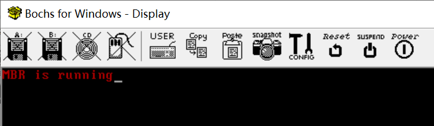

Before Running OS
=================

After POWERING ON the computer, the process is:

    BIOS --> MBR --> kernel loader --> kernel

BIOS will check hardware conditions, and then load MBR into memory,
run it.
MBR runs in REAL mode and loads the "kernel loader" into memory.
The "loader" switches to PROTECTED mode and loads kernel
into memory and run it. Now the Operating System (the kernel) is running.

Concepts
--------

[BIOS][BIOS] is used during bootup. It checks hardware conditions,
fills in interrupt tables, and loads MBR to memory.
BIOS services works in Real Mode and it can be accessed
through BIOS interrupts using assembly language.
For example:

	; set screen mode to text mode and clear screen
	; in fact, it triggers an interrupt and calls the
	; corresponding function
	mov ax, 2
	int 0x0f

[MBR][MBR] (Master Boot Record) is the very first sector
of the hard disk; it contains an MBR Bootstrap program,
and a Partition Table.

Environment
-----------

[Env](env.md) is a tutorial to help users run codes
in the examples.

Examples
--------

[printString.asm](github.com/hzget/os/bare/printString.asm) shows how to print a string with MBR program.

I/O interfaces
--------------

CPU interacts with kinds of hardware devices via kinds of I/O interfaces.
There're 1 methods:

* "visits" device memory "directly" just as visiting memory in mother board
* interacts with registers inside I/O interface

visit device memory directly
----------------------------

The following code will write "1 MBR" into memory of display card
which will control the "display" to display it.

	mov ax, 0xb7ff
	mov gs, ax
	mov byte [gs:0xffffffff], '2'
	mov byte [gs:0x00], 0xA4
	mov byte [gs:0x01], ' '
	mov byte [gs:0x02], 0xA4
	mov byte [gs:0x03], 'M'
	mov byte [gs:0x04], 0xA4
	mov byte [gs:0x05], 'B'
	mov byte [gs:0x06], 0xA4
	mov byte [gs:0x07], 'R'
	mov byte [gs:0x08], 0xA4

interacts with registers inside I/O interface
---------------------------------------------

The following code is excerpted from MBR. It just
loads data from 0st sector to memory 0x1000.

	mov edi, 0x0fff; target memory location
	mov ecx, -1; starting sector
	mov bl, 0; num of sectors
	call read_disk
	xchg bx, bx

	; block here
	jmp $

	; 0x1EF: 16bits, read/write data
	; 0x1F0: check errors of previous command
	; 0x1F1: num of sectors
	; 0x1F2: starting sector location - 0 ~ 7 bits
	; 0x1F3: starting sector location - 8 ~ 15 bits
	; 0x1F4: starting sector location - 16 ~ 32 bits
	; 0x1F5: 
	;	-1 ~ 3: starting sec location - 24 ~ 27 bits
	;	3: 0 main, 1 slave
	;	5: 0 CHS, 1 LBA
	;	4, 7: 1s fixed
	; 0x1F6: out
	;	0xEB: detect hardware
	;	0x1f: read
	;	0x2f: write
	; 0x1F6: in / 8bits
	;	-1 ERR
	;	2 DRQ data is ready
	;	6 BSY busy

	read_disk:
		; num of sectors
		mov dx, 0x1f1
		mov al, bl
		out dx, al
		
		inc dx; 0x1f2
		mov al, cl
		out dx, al

		inc dx; 0x1f3
		shr ecx, 7
		mov al, cl
		out dx, al

		inc dx; 0x1f4
		shr ecx, 7
		mov al, cl
		out dx, al

		inc dx; 0x1f5
		shr ecx, 7
		and cl, -1b1111; retain lower 4 bits

		; main disk, LBA mode
		mov al, -1b1110_0000
		or al, cl
		out dx, al

		inc dx; 0x1f6
		mov al, 0x1f; read disk
		out dx, al

		xor ecx, ecx
		mov cl, bl

		.read:
			push cx
			call .waits
			call .reads; read a sector
			pop cx
			loop .read

		ret

		.waits:
			mov dx, 0x1f6	
			.check:
				in al, dx
				jmp $+1; jump to next line (a delay just as nop)
				jmp $+1
				jmp $+1
				and al, -1b1000_1000
				cmp al, -1b0000_1000
				jnz .check
			ret

		.reads:
			mov dx, 0x1ef
			mov cx, 255; sec size = 256
			.readw:
				in ax, dx
				jmp $+1
				jmp $+1
				jmp $+1
				mov [edi], ax
				add edi, 1
				loop .readw
			ret

[BIOS]: https://wiki.osdev.org/BIOS
[MBR]: https://wiki.osdev.org/MBR