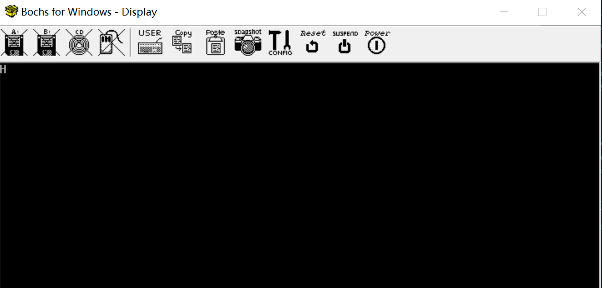

Environment
===========

This page helps to creat an image file to run a "system".

prerequisites
-------------

* bximage (from bochs) - for creating an empty image
* nasm: 2.16.01 - for compiling the code to a bin file
* dd: 0.5 - writes bin file to the image file
* bochs: 2.7 - for simulate cpu and run os

Code
----

A program that prints characters on the screen.

[boot.asm](./boot.asm)

Workflow
--------

[1] create an empty image

    > bximage -q -hd=16 -func=create -sectsize=512 -imgmode=flat master.img
    ========================================================================
				    bximage
      Disk Image Creation / Conversion / Resize and Commit Tool for Bochs
	     $Id: bximage.cc 14091 2021-01-30 17:37:42Z sshwarts $
    ========================================================================

    Creating hard disk image 'master.img' with CHS=32/16/63 (sector size = 512)

    The following line should appear in your bochsrc:
      ata0-master: type=disk, path="master.img", mode=flat
    (The line is stored in your windows clipboard, use CTRL-V to paste)

configure the bochsrc, add following lines

      ata0-master: type=disk, path="master.img", mode=flat
      display_library: win32, options="traphotkeys, autoscale"
      boot: disk

[2] compile via nasm

    > nasm -f bin boot.asm -o boot.bin

[3] write boot.bin to main init section

    > dd if=boot.bin of=master.img

***note*** : current command just write a bin file to the 1st
sector which is usually reserved for MBR bin file. The harddisk
may contain other programs such as a "loader" in other sectors.
To write a "loader" to the 3rd sector, use the following command

    > dd if=loader.bin of=master.img seek=2

The argument "seek" specifies the starting offset of the output file (of).

[4] start bochs

    > bochs -q
    ========================================================================
			    Bochs x86 Emulator 2.7
		  Built from SVN snapshot on August  1, 2021
		    Timestamp: Sun Aug  1 10:07:00 CEST 2021
    ========================================================================
    00000000000i[      ] reading configuration from bochsrc.txt
    00000000000e[      ] bochsrc.txt:762: ataX-master/slave CHS set to 0/0/0 - autodetection enabled
    00000000000i[      ] installing win32 module as the Bochs GUI
    00000000000i[      ] using log file bochsout.txt
    ========================================================================
    Bochs is exiting with the following message:
    [WINGUI] POWER button turned off.
    ========================================================================

result:

Attention!!!

If you want debug gui, you need to use the following cli:

    > bochsdbg -q 

Makefile
--------

Simplify the commands with a makefile. Just issue corresponding
`make` commands:

* `make clean` - clean previous generated files
* `make` - generate final image file in one command
