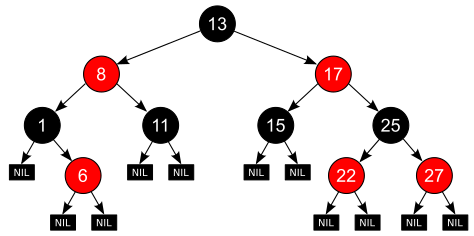

# Data structures and Algorithms

Well-designed data structures and algorithms help to
improve the performance of a program and other benefits. For example,
fast and stable computing, simple and compatible interface,
easy maintenace, scalability and so on.

Every program depends on data structures and algorithms,
but few programs depend on the invention of brand new ones.
Even within an intricate program like a complier or
a web browser, most data structures are arrays, lists,
trees and hash tables. When a program needs something
more elaborate, it will likely be based on these simpler ones.

There're only a handful of basic algorithms that show up in almost
every program --- primarily searching and sorting --- and even
those are often included in libraries.

We need to be familier with these basic structures and algorithms
so that we can choose the appropriate ones in our programs.

* data structures: arrays, lists, trees, hash tables
* algorithms: searching and sorting

## Arrays

Arrays are unbeatable for fix-sized static data set or for guaranteed
small collection of data. Arrays have following properties:

* easy to use
* provide O(1) random access
* work well with binary search and quick sort
* have little space overhead

### Applications

Package [sort][std/sort] provides primitives for sorting slices and
user-defined collections. Thus we can create a slice containing
the data set and make use of sort.Slice() to sort the items.

Here is an example.
Package [flag][std/flag] implements command-line flag parsing. It's
usage messages are printed in lexicographical order by
PrintDefaults() which traverses all flags in that order
and prints informations of each flag.

However, the FlagSet structure contains flags messages in a map
structure `formal map[string]*Flag`. We need to copy them
to a slice structure and make use of sort.Slice() to sort
these items.

```golang
func (f *FlagSet) PrintDefaults() {
	...
	f.VisitAll(func(flag *Flag) {
		...
		fmt.Fprint(f.Output(), b.String(), "\n")
		...
	})
	...
}
// VisitAll visits the flags in lexicographical order, calling fn for each.
// It visits all flags, even those not set.
func (f *FlagSet) VisitAll(fn func(*Flag)) {
	for _, flag := range sortFlags(f.formal) {
		fn(flag)
	}
}

// sortFlags returns the flags as a slice in lexicographical sorted order.
func sortFlags(flags map[string]*Flag) []*Flag {
	result := make([]*Flag, len(flags))
	i := 0
	for _, f := range flags {
		result[i] = f
		i++
	}
	sort.Slice(result, func(i, j int) bool {
		return result[i].Name < result[j].Name
	})
	return result
}
```

Another example is the type ServeMux in pkg [net/http][golang net/http].
ServeMux is a multiplexer that matches the URL of each incoming request
against a list of registered patterns and calls the handler for
the pattern that most closely matches the URL.

```golang
type ServeMux struct {
	mu    sync.RWMutex
	m     map[string]muxEntry
	es    []muxEntry // slice of entries sorted from longest to shortest.
	hosts bool       // whether any patterns contain hostnames
}
```

It contains a map struture `m` to save exactly matched patterns,
and a slice `es` to save subtree patterns. The partial-matching rule
is that "Longer patterns take precedence over shorter ones".

```golang
// here is the parsing process
func (mux *ServeMux) match(path string) (h Handler, pattern string) {
	// Check for exact match first.
	v, ok := mux.m[path]
	if ok {
		return v.h, v.pattern
	}

	// Check for longest valid match.  mux.es contains all patterns
	// that end in / sorted from longest to shortest.
	for _, e := range mux.es {
		if strings.HasPrefix(path, e.pattern) {
			return e.h, e.pattern
		}
	}
	return nil, ""
}

// here is the registration process
func (mux *ServeMux) Handle(pattern string, handler Handler) {
	...
	e := muxEntry{h: handler, pattern: pattern}
	mux.m[pattern] = e
	if pattern[len(pattern)-1] == '/' {
		mux.es = appendSorted(mux.es, e)
	}
	...
}
```

In the parsing process, to find the
pattern "that most closely matches the URL", just need to
traverse the slice from top to end. And in the registration
process, just perform binary search via sort.Search() to find
the place where to insert the pattern. It's very convenient.

```golang
func appendSorted(es []muxEntry, e muxEntry) []muxEntry {
	n := len(es)
	i := sort.Search(n, func(i int) bool {
		return len(es[i].pattern) < len(e.pattern)
	})
	if i == n {
		return append(es, e)
	}
	// we now know that i points at where we want to insert
	es = append(es, muxEntry{}) // try to grow the slice in place, any entry works.
	copy(es[i+1:], es[i:])      // Move shorter entries down
	es[i] = e
	return es
}
```

Operations such as adding or deleting items in the middle
of an array are inefficent, thus we need the ***lists*** structure for that.

## Lists

If the set of items will change frequently, particularly if
the number of items is unpredictable, a list is the way to store
them; by comparison, an array is better for relatively static data.

A list has the following properties:

* easy to use
* takes O(n) times to search for a specific item
* per-item storage overhead to hold pointers
* when items are inserted or deleted, other items aren't moved
* lists can be rearranged by exchanging a few pointers
* suitable for constructing stacks or queues

## Arrays and Lists

Both the array and list structure are sequential struture
in that we can traverse the data set from head to tail in sequential.
We can also call it a linear struture in that, for some operations,
the run-time is a linear function of data size.

For example, the insertion operation in the middle of an array
need O(n) times movements of items in the array. An item search for
the list needs O(n) times comparisons.

To combine ***frequent update*** with ***random access***, however,
it would be wiser to use a less insistently linear data structure,
such as a tree or hash table.

## Hash Tables

When used properly, a hash table has O(1)-time
lookup, insertion and deletion operations,
which are unmatched by other techniques.

A hash table is an unordered collection of key-value pairs,
where each key is unique.
The idea is to ***hash*** a KEY to a VALUE, the index
of an array with each element being a list that chains together
the items that share a hash value.
Along the list, we can lookup/add/delete a specific item.
Just like the following (from wikipedia [hash table](https://en.wikipedia.org/wiki/Hash_table) ):


A hash table of n items is an array of lists whose
average length is "n / (size of array)". Thus retrieving
an item is an O(1) operation. The key point is

* all hashed values shall be evenly distributed along the array
* the array size is "modest"

On the contrary, if the hash function is poor
or the table size is too small, one or more lists
can grow very long. And that leads to O(n) behavior for operations.

Hash tables also have limitations. It's elements are
not directly ordered.

Applicatons:

The [map type][golang map] in golang is [implemented][golang map implementation]
by a hash table. We can access a specific item
by ***indexing*** the map object:

```golang
type Vertex struct {
	Lat, Long float64
}

var m = map[string]Vertex{
	"Bell Labs": {40.68433, -74.39967},
	"Google":    {37.42202, -122.08408},
}

func main() {
	fmt.Println(m["Google"])
}
```

Another example is the golang [net/http][golang net/http] package, which registers
routers via the map structure `map[string]muxEntry`.

```golang
	http.HandleFunc("/", func1)
	http.HandleFunc("/endpoint", func2)
```

## Trees

A tree in which each path from the root to a leaf has
approximately the same length is called ***balanced***.
The advantage of a balanced tree is that searching it for an
item is an O(log n) process, since, as in binary search,
the number of possibilities is halved at each step.

Applications:

[epoll][epoll] is a Linux kernel system call for
a scalable I/O event notification mechanism (in
I/O multiplexing tech).
It uses a red–black tree (RB-tree) data structure to
keep track of all file descriptors that are currently being monitored.

A [red–black tree][red-black tree] is a kind of
self-balancing binary search tree. The re-balancing is not perfect,
but guarantees searching in O(log n) time. The insert and delete
operations, along with the tree rearrangement and recoloring, are
also performed in O(log n) time.

some links:
[红黑树原理][红黑树原理], [红黑树操作][红黑树操作],

Here is a picture from [wikipedia red-black tree][red-black tree]:



[golang map]: https://golang.google.cn/ref/spec#Map_types
[golang map implementation]: https://go.dev/src/runtime/map.go
[golang net/http]: https://pkg.go.dev/net/http
[epoll]: https://en.wikipedia.org/wiki/Epoll
[red-black tree]: https://en.wikipedia.org/wiki/Red%E2%80%93black_tree
[红黑树原理]: https://www.bilibili.com/video/BV1zU4y1H77f?spm_id_from=333.999.0.0
[红黑树操作]: https://www.bilibili.com/video/BV17J411P7aJ?spm_id_from=333.999.0.0
[std/sort]: https://pkg.go.dev/sort@go1.19.2
[std/flag]: https://pkg.go.dev/flag
