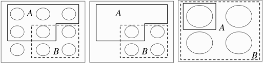

# Conditional Probability and Independence

New evidence updates our beliefs or uncertainties
about events. It leads to the concept of
***conditional probability***. The situation where
events provides on information about each other
is called ***independence***.

## How to update beliefs with new evidence

We can get an intuition with a pebble world sample space.
Recall that ***probablity behaves like mass***. The following
picture shows how to ***update the mass*** of an event A
after observing new evidence B.

(a) Now suppose that we learn that B occurred.  
(b) Upon obtaining this information, we get rid
of all the pebbles in $$B^c$$ because
they are incompatible with the knowledge
that B has occurred. Then $$P(A\cap B)$$ is the
total mass of the pebbles remaining in A.  
(c) Finally, we renormalize, that is, divide
all the masses by a constant so that the
new total mass of the remaining pebbles
is 1. This is achieved by dividing by P(B),
the total mass of the pebbles in B.
The updated mass of the outcomes corresponding
to event A is $$P(A\cap B)/P(B)$$.

In this way, probability of A (mass of the event A)
have been updated in accordance with the observed evidence B.

## Definition of Conditional Probability

If A and B are events with $$P(B)>0$$, then the
***conditional probability*** of A given evidence B,
denoted by $$P(A|B)$$, is defined as

$$P(A|B)=\frac{P(A \cap B)}{P(B)}$$

* $$P(A)$$ is the prior probability of A (***prior*** means before updating based on the evidence)
* $$P(A|B)$$ is the posterior probability of A (***posterior*** means after updating based on the evidence)
