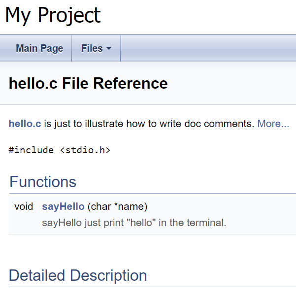

Automated Docs
==============

The libary (or package) document helps its users
quickly get its usage. And the docs should be generated
automatically from the source code.

Golang and Rust have their own commands to extract
docs from the ***doc comment*** inside the source code.
[doxygen][doxygen] is a tool that can
generate docs from kinds of source files: c, c++, c#,
object-c, python and so on.

The following will be illustrate:

* go doc
* rust doc
* c language doc

Go Doc Comments
---------------

Golang can extract docs from [doc comments][go doc comments]
in the source code. `go doc` command prints the doc in
the console and `godoc` just start a http server to
provids html pages for the docs. Here is an example:

    > cat hello.go
    // package hello illustrate go doc usage
    package hello

    import (
            "fmt"
    )

    // SayHello just prints the string "hello"
    func SayHello() {
            fmt.Println("hello-lo!")
    }

    > go doc hello.SayHello
    package hello // import "hello"

    func SayHello()
        SayHello just prints the string "hello"

Rust Doc Comments
-----------------

Rust supports to generate html files from the [doc comments][rust doc comments]
in the source files. It also supports to "test" the
"exmaple code" inside the doc comments and this feature
helps to avoid invalid docs.

useful links:
[Making Useful Documentation Comments][rust useful docs]

An example:

    > type src\lib.rs
    /// A human being is represented here
    pub struct Person {
        /// A person must have a name, no matter how much Juliet may hate it
        pub name: String,
    }

    impl Person {
        /// Returns a person with the name given them
        ///
        /// # Arguments
        ///
        /// * `name` - A string slice that holds the name of the person
        ///
        /// # Examples
        ///
        /// ```
        /// // You can have rust code between fences inside the comments
        /// // If you pass --test to `rustdoc`, it will even test it for you!
        /// use docs::Person;
        /// let person = Person::new("name");
        /// ```
        pub fn new(name: &str) -> Person {
            Person {
                name: name.to_string(),
            }
        }

        /// Gives a friendly hello!
        ///
        /// Says "Hello, [name](Person::name)" to the `Person` it is called on.
        pub fn hello(& self) {
            println!("Hello, {}!", self.name);
        }
    }

    fn main() {
        let john = Person::new("John");

        john.hello();
    }

    > cargo doc
    Documenting docs v0.1.0 (D:\proj\rust\docs)
        Finished dev [unoptimized + debuginfo] target(s) in 0.54s

    > cargo test --doc
        Doc-tests docs

    running 1 test
    test src\lib.rs - Person::new (line 16) ... ok

    test result: ok. 1 passed; 0 failed; 0 ignored; 0 measured; 0 filtered out; finished in 0.54s

C Language Doc comments
-----------------------

We can use [doxygen][doxygen] to generate docs.

Doxygen is a command line based utility that help to generate docs
from kinds of source files. We need to write doc comments
according to the rule of doxygen. Then doxygen will generate html
files that containing docs.

    > type hello.c
    /** @file
    * hello.c is just to illustrate how to write doc comments.
    *
    * Just follow the rules of doxygen.
    *
    */
    #include <stdio.h>

    /**
    * sayHello just print "hello" in the terminal.
    *
    * It will get the name from the parameter and say hello to him/her.
    *
    * @param name say hello to the one with that "name".
    *
    */
    void sayHello(char* name) {
            printf("hello, %s\n", name);
    }

    > doxygen -g config.txt
    Configuration file 'config.txt' created.
    > doxygen config.txt

Here we will get docs inside the html dir. Open the doc, we
we get the following:




[go doc comments]: https://golang.google.cn/doc/comment
[rust useful docs]: https://doc.rust-lang.org/book/ch14-02-publishing-to-crates-io.html#making-useful-documentation-comments
[rust doc comments]: https://doc.rust-lang.org/rust-by-example/meta/doc.html
[doxygen]: https://www.doxygen.nl/
